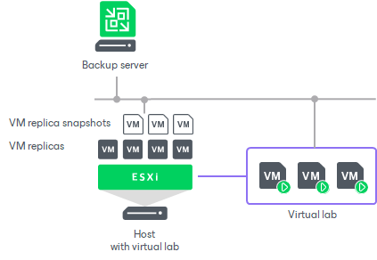

# How SureReplica Works

In this article

SureReplica is Veeam’s technology that lets you test a VM replica for recoverability. To ensure that the VM replica is functioning properly, Veeam Backup & Replication performs its “live” verification. Veeam Backup & Replication automatically boots the VM replica from the necessary restore point in the isolated environment, performs tests against the VM replica, powers it off and creates a report on the VM replica state.

SureReplica supports regular VM replicas and VM replicas added to a CDP policy. SureReplica verification does not prevent CDP policy from running.

The SureReplica technology does not require the vPower engine. A VM replica is essentially an exact copy of a VM with a set of restore points. The VM replica data is stored in the raw decompressed format native to VMware. Therefore, to start a VM replica in the virtual lab, you do not need to present its data through the vPower NFS datastore to the ESXi host. Veeam Backup & Replication re-configures the VM replica settings for recovery verification, connects the VM replica to the isolated virtual lab and powers it on.

As there is no need to publish the VM from the backup file, the SureReplica processing is typically faster than SureBackup. Subsequently, the [U-AIR](https://www.veeam.com/veeam_backup_12_uair_wizard_user_guide_pg.pdf) and On-Demand Sandbox operations are faster, too.

During VM replica verification, Veeam Backup & Replication performs the following actions:

1. Veeam Backup & Replication triggers a VMware snapshot for a VM replica. The snapshot protects the VM replica from changes while it is running. All changes made to the VM replica are written to the delta file.

During verification of a VM replica added to a CDP policy, Veeam Backup & Replication does not trigger a VMware snapshot of this VM replica.

1. If antivirus software scan is enabled, Veeam Backup & Replication performs antivirus scan and use backup server as the mount server during this operation.
2. Veeam Backup & Replication starts the VM replica in the virtual lab.
3. Veeam Backup & Replication performs tests against the verified VM replica.
4. When the verification process is over, Veeam Backup & Replication removes the delta file of the VM replica snapshot, powers off the VM replica and creates a report on its state. The report is sent to the backup administrator by email.

|  |
| --- |
| Note |
| Veeam Backup & Replication verifies only VM replicas in the Ready state. If a VM replica is in the Failover or Failback state, the verification process fails. |

To perform VM replica verification, you need to create the following objects:

1. [Application group](surereplica_application_group.md). During recovery verification, the VM replica is not started alone: it is started together with VMs on which the VM replica is dependent. Starting a VM replica in conjunction with other VMs enables full functionality of applications running inside the VM replica and lets you run these applications just like in the production environment.
2. [Virtual lab](surereplica_vlab_config.md). The virtual lab is the isolated virtual environment in which the VM replica and VMs from the application group are started and tested.
3. [SureBackup job](surereplica_job.md). The SureBackup job is a task for VM replica verification process. You can run the SureBackup job manually or schedule it to run automatically by schedule.

Page updated 8/20/2024

Page content applies to build 13.0.1.1071
