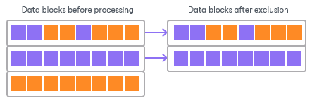

# Swap Files

You can instruct Veeam Backup & Replication to exclude pagefile.sys and hiberfil.sys files from backups or replicas of Microsoft Windows VMs. As a result, the size of incremental backups and replicas will be smaller.

* hiberfil.sys is a system file created by the OS for the correct work of the hibernate mode.
* pagefile.sys is a swap file. Swap files are dynamic and can change intensively between job sessions, even if a VM itself does not change much.

How Swap File Exclusion Works

When you exclude pagefile.sys and hiberfil.sys files, Veeam Backup & Replication performs the following operations during the job session:

1. Veeam Backup & Replication accesses the MFT file on the VM guest OS to identify data blocks of pagefile.sys and hiberfil.sys files and zeros them out.
2. Veeam Backup & Replication processes and transports data blocks of the VM image in the following manner:

+ If a data block of the VM image contains only blocks of these files, Veeam Backup & Replication does not copy this data block to the target.
+ If a data block of the VM image contains blocks of these files and other data, Veeam Backup & Replication copies this block to the target.

Limitations for Swap File Exclusion

Veeam Backup & Replication can exclude blocks of pagefile.sys and hiberfil.sys files only on the VM guest OS with Microsoft Windows NTFS.

Related Topics

* [Configure swap file exclusion for backup jobs](backup_job_advanced_storage_hv.md)
* [Configure swap file exclusion for replication jobs](replica_advanced_traffic_hv.md)

