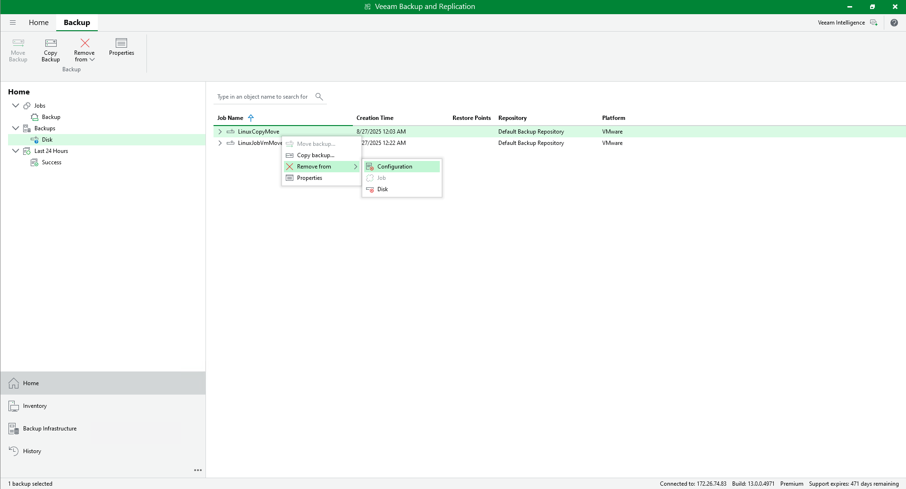
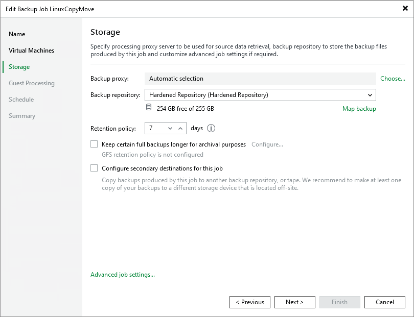
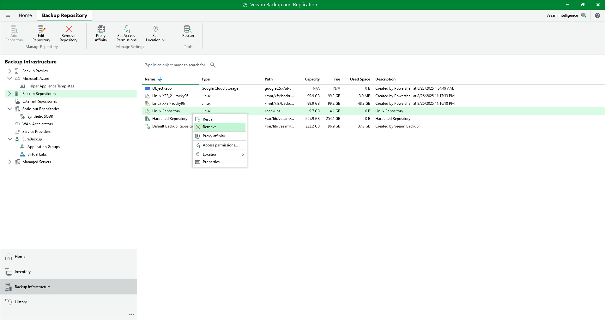

# Upgrading or Switching Linux Repositories to Hardened Repositories

|  |
| --- |
| Important |
| A Veeam Infrastructure Appliance used as a backup repository cannot be upgraded to a hardened repository. |

If you have a standalone Linux server added to the backup infrastructure as a backup repository and want to use it as a hardened repository, perform the following steps:

1. On the Linux server, change permissions for the directory where backups are stored. Both owner and group must be the account with non-root permissions you use to connect to the Linux server.

|  |
| --- |
| chown -R owner:group <dir\_path> |

1. Go to the Veeam Backup & Replication console and perform the following steps:

1. Open the Backup Infrastructure view and select Managed Servers in the management pane. Right-click the Linux server, select Properties, go to the Access step of the wizard, and specify the account with non-root permissions you use to connect to the Linux server. Note that these credentials must be single-use.
2. Disable all backup jobs that use this Linux repository. For more information, see [Disabling and Deleting Jobs](disabling_jobs.md).

|  |
| --- |
| Note |
| If you have Veeam Agent backup jobs managed by Veeam Agent, you need to delete these jobs and configure them once again after you switch to the hardened repository. |

1. Remove backup files stored on the Linux repository from the backup configuration. To do this, go to the Backups > Disk node and select the backup file. Hold [Ctrl] and right-click the file. Then click Remove from Configuration.

|  |
| --- |
| Important |
| Removing backups from configuration is designed for experienced users only. It is strongly recommended to create [encrypted configuration backup](config_backup_encrypted.md) before performing this operation. |

1. Add the same Linux server to the backup infrastructure as a hardened repository using the New Backup Repository wizard. At the Review step of the wizard, select the Search the repository for existing backups and import them automatically check box to detect existing backup files and display them in the Veeam Backup & Replication console under the Imported > Backups node. For more information, see [Adding Hardened Repositories](hardened_repository_add.md).

|  |
| --- |
| Note |
| If you work with encrypted backups, you need to decrypt them after importing. For more information, see [How Data Decryption Works](decryption_hiw.md). |

1. Go to the Jobs node and edit the job associated with the Linux repository. At the Storage step of the wizard, select the hardened repository from the Backup repository list.

Click Map backup and specify imported backups from the previous step.

Finish the wizard to apply changes.

1. Open the Backup Infrastructure view and remove the Linux-based backup repository from the backup infrastructure.

|  |
| --- |
| Note |
| For more information on enabling immutability for tenant backups, see the [Switching from Linux Repository to Hardened Repository](https://helpcenter.veeam.com/docs/vbr/cloud/cc_sobr_migration_linux.html?ver=13) section in the Veeam Cloud Connect Guide. |

