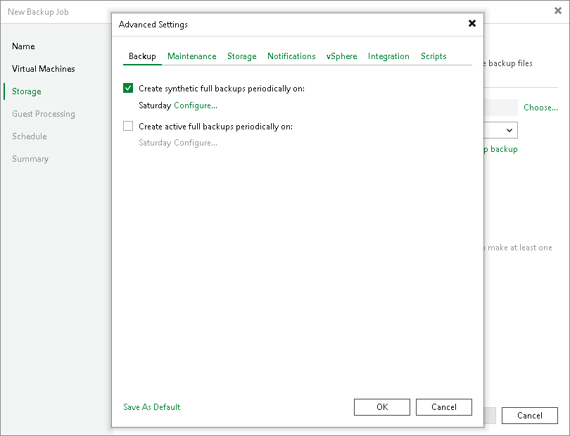

# Synthetic Full Backup

In some situations, periodically running active full backups may not be an option. Active full backups are resource-intensive and consume a considerable amount of network bandwidth. As an alternative, you can create synthetic full backups.

In terms of data, the synthetic full backup is identical to a regular full backup. A synthetic full backup produces a VBK file that contains data of the whole VM. The difference between active and synthetic full backup lies in the way VM data is retrieved:

* When you perform an active full backup, Veeam Backup & Replication retrieves VM data from the source datastore where the VM resides, compresses and deduplicates it and writes it to the VBK file in the backup repository.
* When you perform a synthetic full backup, Veeam Backup & Replication does not retrieve VM data from the source datastore. Instead, it synthesizes a full backup from data you already have in the backup repository. Veeam Backup & Replication accesses the previous full backup file and a chain of subsequent incremental backup files on the backup repository, consolidates VM data from these files and writes consolidated data into a new full backup file. As a result, the created synthetic full backup file contains the same data you have if you create an active full backup.

The synthetic full backup has several advantages:

* The synthetic full backup does not use network resources; it is created from backup files you already have on disk.
* The synthetic full backup produces less load on the production environment: it is synthesized right on the backup repository.

Veeam Backup & Replication treats synthetic full backups as regular full backups. As well as any other full backup file, the synthetic full backup file resets the backup chain. All subsequent incremental backup files use the synthetic full backup file as a new starting point. A previously used full backup file remains on disk until it is automatically deleted according to the retention policy.

|  |
| --- |
| Important |
| Consider the following:   * If you enable both synthetic and active full backups and schedule their creation on the same day, the synthetic full backup is not created.  * If you schedule a job to start after another job (initial job), but the initial job does not run on days when the synthetic full backup is scheduled for the chained job, Veeam Backup & Replication will not create synthetic full backups.  * Synthetic full backups cannot be created independently for backup jobs targeted at object storage. To include synthetic full backups in the backup process, you must enable the GFS policy. |

To create synthetic full backups, you must enable the Create synthetic full backups periodically on option and schedule the creation of synthetic full backups on specific days.

Related Topics

[How Synthetic Full Backup Works](synthetic_full_hiw.md)

