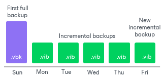
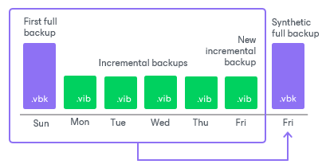
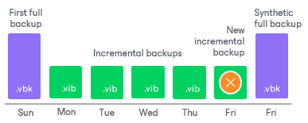

# How Synthetic Full Backup Works

To understand how synthetic full backups are created, consider the following example. The backup job starts on Sunday, with synthetic full backups scheduled on Friday. Active full backups are not configured.

Veeam Backup & Replication creates a synthetic full backup in the following way:

1. On a day when a synthetic full backup is scheduled, Veeam Backup & Replication triggers a new backup job session. During this session, Veeam Backup & Replication first performs incremental backup in a regular manner and adds a new incremental backup file to the backup chain.

Veeam Backup & Replication retrieves VM data for this incremental backup file from the production storage. Incremental backup helps Veeam Backup & Replication ensure that the synthetic full backup includes the latest changes of the source VM in the production environment.

1. At the end of the backup job session, Veeam Data Mover on the backup repository builds a new synthetic full backup using backup files that are already available in the backup chain, including the newly created incremental backup file.

1. When the synthetic full backup is created, Veeam Data Mover on the backup repository deletes the incremental backup file created at the beginning of the job session. As a result, you have a backup chain that consists of a full backup file, a set of incremental backup files and a synthetic full backup file.

1. Every next job session creates a new incremental restore point, starting from the synthetic full backup until the day on which the synthetic full backup is scheduled. On that day, Veeam Backup & Replication creates a new synthetic full backup.

Synthetic Full Backup Schedule

Veeam Backup & Replication automatically triggers a backup job session to create a synthetic full backup, even if a regular backup job session is not scheduled on this day. The job session is started at the same time the parent backup job is scheduled. For example, if you schedule the parent backup job at 12:00 AM Sunday through Friday and schedule a synthetic full backup on Saturday, Veeam Backup & Replication will start a backup job session that will produce a synthetic full backup at 12:00 AM on Saturday.

If a regular backup job is scheduled together with a synthetic full backup, Veeam Backup & Replication will produce only one backup file — a synthetic full backup that will contain the latest state of the source VM. An incremental backup file that should have been created by the backup job schedule will not be added to the backup chain.

If an active full backup is scheduled together with a synthetic full backup, Veeam Backup & Replication will create only the active full backup.

Veeam Backup & Replication creates a synthetic full backup only once a day on which synthetic full backup is scheduled. If you run the backup job again on the same day, Veeam Backup & Replication will perform incremental backup in a regular manner.

If an active or synthetic full backups are scheduled for the chained job, but the initial job does not run on these days, the active and synthetic full backups will not be created for the chained job. For more information, see [Chained Jobs](job_schedule.md#chain).

