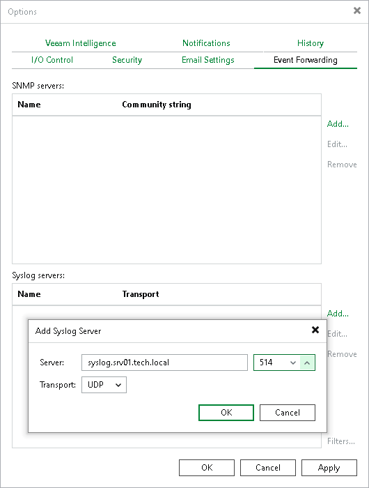

# Adding Syslog Server Using Console

In this article

To add a syslog server, do the following in the Veeam Backup & Replication console:

1. From the main menu, select Options > Event Forwarding.
2. In the Syslog servers section, click Add.
3. In the Server field, specify the FQDN or IPv4 address of the server. You cannot specify the IPv6 address in this field.
4. In the Transport field, specify the transport protocol: TCP, UDP or TLS. Default port numbers are 514 (for TCP and UDP) and 6514 (for TLS).
5. Click OK.

|  |
| --- |
| Note |
| If the syslog server is unavailable, the error message will be displayed. |

|  |
| --- |
| Tip |
| If required, you can also configure the following specific parameters on the backup server:   * Add the Unicode byte order mask (BOM) before the MSG field * [For TCP or TLS connections] Use the octet count prefix as a syslog message delimiter instead of \n character * [For TCP connections] Specify custom connection timeout   To configure these parameters, see [this Veeam KB article](https://www.veeam.com/kb4522). |

Page updated 7/31/2025

Page content applies to build 13.0.1.1071
