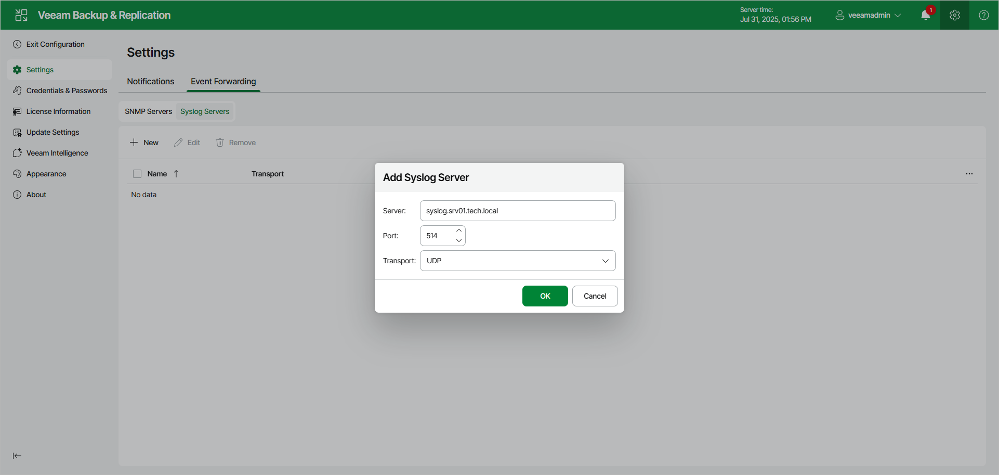

# Adding Syslog Server Using Web UI

To add a syslog server, do the following in the Veeam Backup & Replication web UI:

1. Click the gear icon in the top bar.
2. Click the Event Forwarding tab.
3. In the Syslog Servers tab, click New.
4. In the Server field, specify the FQDN or IPv4 address of the server. You cannot specify the IPv6 address in this field.
5. In the Port field, enter the port number to be used. Default port numbers are 514 (for TCP and UDP) and 6514 (for TLS).
6. In the Transport field, specify the transport protocol: TCP, UDP or TLS.
7. Click OK.

|  |
| --- |
| Note |
| If the syslog server is unavailable, the error message will be displayed. |

To edit the existing server, use the check box before the required server name, click Edit and make all necessary changes.

|  |
| --- |
| Tip |
| If required, you can also configure the following specific parameters on the backup server:   * Add the Unicode byte order mask (BOM) before the MSG field * [For TCP or TLS connections] Use the octet count prefix as a syslog message delimiter instead of \n character * [For TCP connections] Specify custom connection timeout   To configure these parameters, see [this Veeam KB article](https://www.veeam.com/kb4522). |

