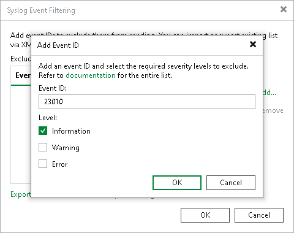
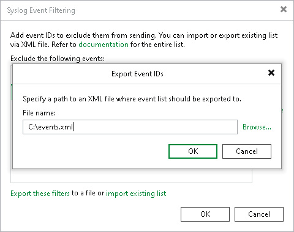
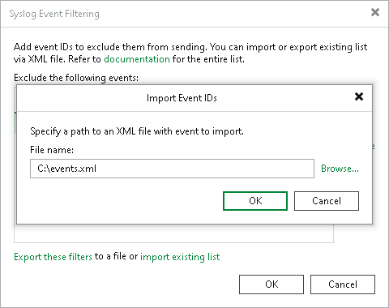

# Filtering Events

In this article

You can exclude specific events from sending them to the syslog server. To do this, perform the following steps:

1. From the main menu, select Options > Event Forwarding.
2. In the Syslog servers section, click Filters.
3. In the Syslog Event Filtering window, click Add.
4. Enter the event ID and select the severity level. For more information about event IDs, see [Event Reference](https://helpcenter.veeam.com/docs/vbr/events/event_id_list.html?ver=13).
5. Click OK.

You can also export and import the list of event IDs in the XML format.

Exporting Event IDs

To export event IDs, do the following:

1. From the main menu, select Options > Event Forwarding.
2. In the Syslog servers window, click Filters.
3. Click Export these filters.
4. Click Browse and select the folder to save the file.
5. Specify the name of the file and click Save.
6. Click OK.

Importing Event IDs

To import event IDs, do the following:

1. From the main menu, select Options > Event Forwarding.
2. In the Syslog servers window, click Filters.
3. Click Import existing list.

|  |
| --- |
| Important |
| The import operation will override event IDs you added earlier. It is recommended to export your current list before you import a new one. |

1. Click Browse and select the folder where the file is located.
2. Select the file and click Open.
3. Click OK.

A valid XML Schema for the list must contain the following elements:

| Element | Description |
| --- | --- |
| SyslogFilteredEvents | Root element. |
| FilteredEvent | Child element of the SyslogFilteredEvents element. Each FilteredEvent contains an event that must be excluded from sending.  The element has the following attributes:   * EventId — Event ID. * FilterInfo — Defines whether to exclude this event if it has the Information severity level. Possible values: True, False. * FilterWarning — Defines whether to exclude this event if it has the Warning severity level. Possible values: True, False. * FilterError — Defines whether to exclude this event if it has the Error severity level. Possible values: True, False. |

Example:

|  |
| --- |
| <SyslogFilteredEvents>   <FilteredEvent EventId="23010" FilterInfo="True" FilterWarning="False" FilterError="False" />  </SyslogFilteredEvents> |

Page updated 8/7/2025

Page content applies to build 13.0.1.1071
