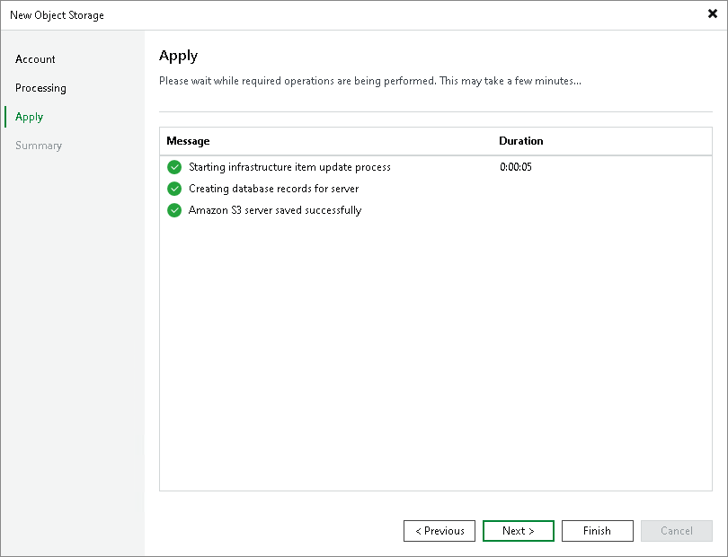

# Step 4. Apply Object Storage Settings

In this article

At the Apply step of the wizard, wait till Veeam Backup & Replication installs and configures all required components and adds the object storage to the backup infrastructure. Click Next to proceed.

Page updated 12/6/2023

Page content applies to build 13.0.1.1071
