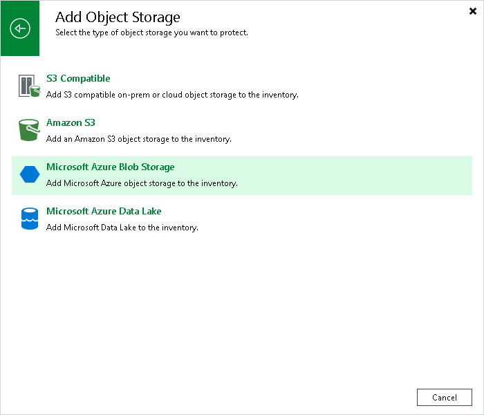

# Step 1. Launch New Object Storage Wizard

To launch the New Object Storage wizard:

1. Open the Inventory view.
2. Do one of the following:

* In the inventory pane, right-click the Unstructured Data node and select Add unstructured data source.
* Select the Unstructured Data node and click Add Data Source on the ribbon.
* Select the Unstructured Data node and click Add Data Source in the working area.

* If at least one object storage is added as the unstructured data source, open the Object Storage node, right-click empty space in the working area and click Add object storage. Alternatively, you can right-click the Object Storage node, and click Add object storage.

1. In the Add Unstructured Data Source window, select Object storage > Microsoft Azure Blob Storage.

