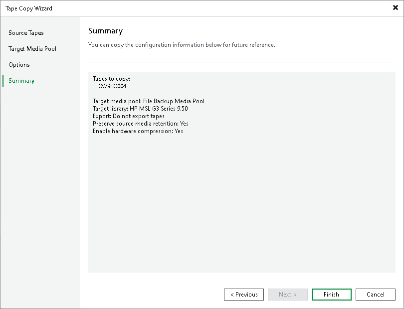

# Step 5. Finish Working with Wizard

In this article

At the Summary step of the wizard, review the configuration and click Finish.

After that, the tape copy job will start. You can track its progress in the displayed Tape Copy window.

To get an email report about the results of the tape copy job processing, enable notifications as described in [Configuring Global Email Notification Settings](general_email_notifications.md). If there are too many issues reported after the tape copy job, the job session log in Veeam Backup & Replication UI displays only first 10 files that failed to be copied. For a full list of errors with detailed paths and tape IDs, open the detailed report in the CSV format stored in the folder where tape verification job logs are stored. For convenience, the path to this folder is specified in the job session log in UI and in the email report.

Page updated 5/21/2025

Page content applies to build 13.0.1.1071
