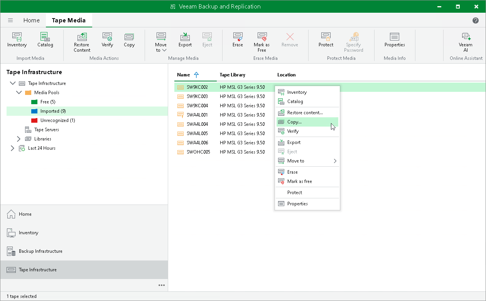

# Step 1. Launch Copy Tapes Wizard

To launch the Copy Tapes wizard, do the following:

1. Open the Tape Infrastructure view.
2. Navigate to the list of tapes either under Media Pools > MediaPoolName or under Libraries > LibraryName node > Media > Online.

|  |
| --- |
| Note |
| The following tapes cannot be copied:   * tapes in the Unrecognized media pool * free tapes (tapes in the Free media pool) * encrypted tapes * cleaning tapes |

1. Select the necessary tape and click Copy on the ribbon. Alternatively, you can right-click the tape and select Copy.

