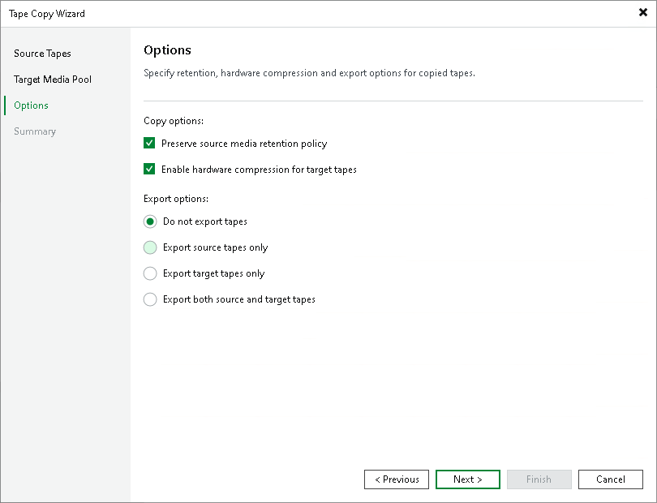

# Step 4. Specify Tape Copy Options

At the Options step of the wizard, specify tape copy and tape export options.

* If you want to copy retention settings of the source tapes to the target tapes, select the Preserve source media retention policy check box.

If you are copying several tapes with different retention settings, Veeam Backup & Replication will set retention policy for the target tapes to the maximum retention among the source tapes.

* If you want to enable hardware compression while writing new tapes, select the Enable hardware compression for target tapes check box.
* If you want to export source media, target media, or both after the tape copying finishes, change the default Do not export tapes option in the Export options section to the one that most suits your case. For details on tape export, see [Exporting Tapes](importing_exporting_tape_media.md).

