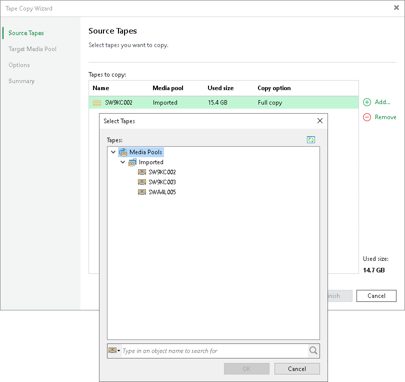

# Step 2. Choose Source Tapes to Copy

At the Source Tapes step of the wizard, select source tapes to copy. The tape that you selected when launching the wizard is added to the list of tapes to copy by default. To add other tapes to copy, do the following:

1. Click Add. Veeam Backup & Replication opens the Select Tapes window listing all media pools and tapes in them available for copying.
2. In the Select Tapes window, navigate to the required media pool and select the tape you want to copy.

Within one tape copy session, you can copy tapes of one type only: either tapes from a regular media pool, or tapes from a GFS media pool. You cannot combine them.

When writing backup files to tapes, there can be situations where a file does not fit on a tape. Then Veeam Backup & Replication divides it into parts and writes to several tapes, which are then considered dependent. Veeam Backup & Replication tracks this. When you are copying data from a tape that contains only one part of the backup file, Veeam Backup & Replication detects that. When you click Next, Veeam Backup & Replication informs you which tapes contain other parts of the file and prompts you to add these tapes to the list for copying complete content. You can agree to add these tapes to the job. Then Veeam Backup & Replication will copy these tapes marked as Partially cloned in the Copy option column only partially: it will copy only data required for cloning full content of the initially selected tapes in the consistent manner. Or you can refuse to add dependent tapes for copying. Then Veeam Backup & Replication will not copy files that are not complete from initially selected tapes. The Used size column shows the total size of the backups/files on each tape that will be copied. It does not include encrypted backups that are skipped when copying tapes or file parts that do not have accompanying file parts stored on dependent tapes.

To remove tapes from the copy list, select the tapes and click Remove.

