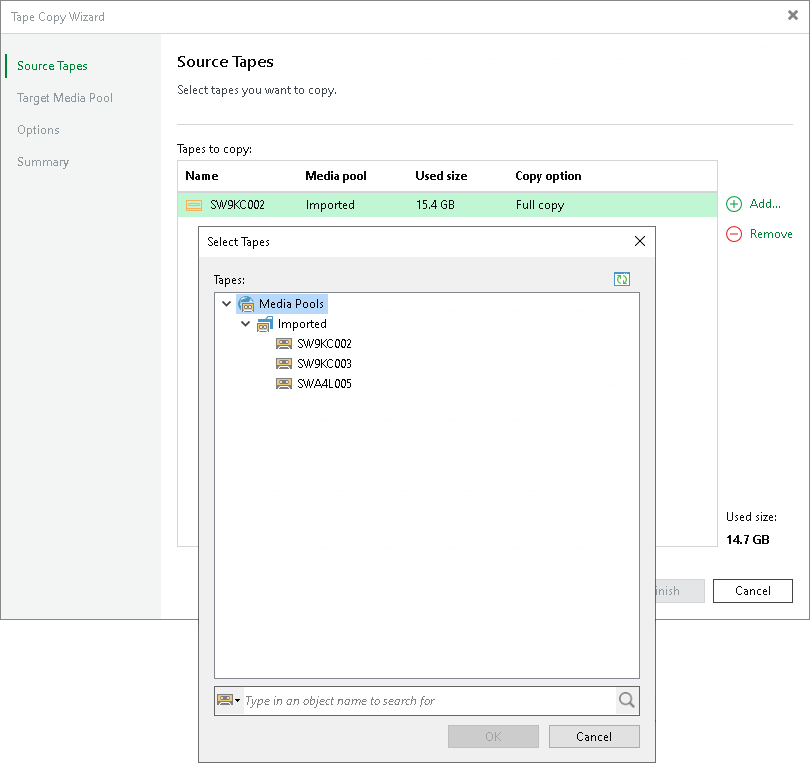

# Step 2. Choose Source Tapes to Copy

At the Source Tapes step of the wizard, select source tapes to copy. The tape that you selected when launching the wizard is added to the list of tapes to copy by default. To add other tapes to copy, do the following:

1. Click Add. Veeam Backup & Replication opens the Select Tapes window listing all media pools and tapes in them available for copying.
2. In the Select Tapes window, navigate to the required media pool and select the tape you want to copy.

|  |
| --- |
| Note |
| Within one tape copy session, you can copy tapes of one type only: either tapes from a regular media pool, or tapes from a GFS media pool. You cannot combine them. |

When writing backup files to tapes, there can be situations where a file does not fit on a tape. Then Veeam Backup & Replication divides it into parts and writes it to several tapes, which are then considered dependent. Veeam Backup & Replication tracks what parts of the file are on which tape. When you are copying data from a tape that contains only one part of the backup file, Veeam Backup & Replication detects that and informs you which tapes contain the remaining parts of the file. You will be prompted to add these tapes to the list to make a complete file copy:

* If you agree to add these tapes to the job, the tapes will be added to the list of tapes to copy and marked as Partial Copy in the Copy option column. Veeam Backup & Replication will copy only the data required for cloning full content of the initially selected tapes in the consistent manner.
* If you refuse to add dependent tapes for copying, Veeam Backup & Replication will not copy incomplete files from initially selected tapes. These files will be skipped.

The Used size column shows the total size of the backups/files on each tape that will be copied. It does not include encrypted backups or incomplete files which are skipped from processing.

To remove tapes from the copy list, select the tapes and click Remove.

