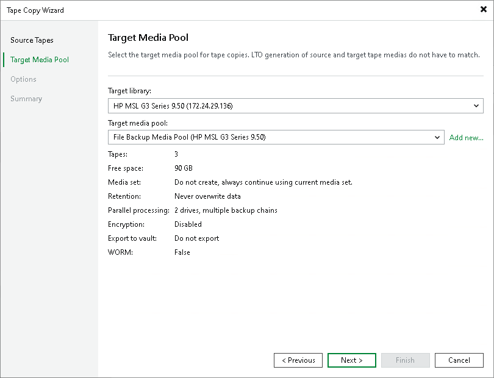

# Step 3. Choose Target Media Pool

In this article

At the Target Media Pool step of the wizard, specify where you want to copy the source tapes to.

|  |
| --- |
| Note |
| The target media pool must be of the same type as the source media pool: they both must be either regular media pools, or GFS media pools. |

1. From the Target library drop-down list, select the tape library that will store copies of source tapes.
2. From the Target media pool drop-down list, select a target media pool to copy source tapes to.

If you have configured a media pool in advance, select it from the drop-down list. Otherwise, click Add New and add a media pool as described in section [Creating Media Pools](creating_custom_media_pools.md).

If the target media pool is the same as the source media pool, Veeam Backup & Replication prompts you to first close the existing media set, start a new media set and then copy the tape there.

Page updated 3/14/2025

Page content applies to build 13.0.1.1071
