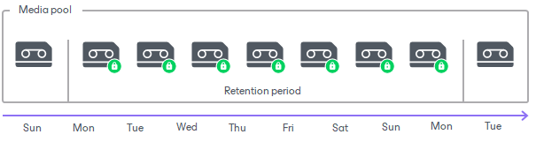

# Tape Data Retention

Data retention period is a period of time when data written to tapes is protected from overwriting.

Retention period is set by user for media pool and is applied to all tapes in this media pool. To set the retention policy, you can choose between the following options:

* Never overwrite data.
* Protect data for a particular time interval.
* Do not protect data (cyclically overwrite tapes as required).

During the retention period, Veeam Backup & Replication will not overwrite data on tape. If a tape contains several backup sets, it will expire when the backup set with the longest retention period expires.

You can change the retention at any time. When you change the retention policy, you can select if this modification works for tapes that will be written after you apply this change or also to tapes that are already recorded. In the latter case, the retention settings of the recorded tapes will change immediately and will be applied to tapes that are both online and offline.

|  |
| --- |
| Note |
| If you choose to set a shorter retention period and apply the retention settings to all tapes, some of your tapes may immediately become outdated. Such tapes will be queued for overwriting. Be careful when applying a new retention policy in order not to lose any data you need, or use the protection option. For more information, see [Tape Protection](tape_protection.md). |

Tape Retention and Disk Retention

For [forward incremental](forward_incremental_backup.md) and [reverse incremental](reversed_incremental_backup.md) backup chains, it is strongly recommended that you set the retention period for the tape archive at least twice longer than the retention period for source backups on disk. The tape jobs analyze the existing tape archives and synchronize them with disk backups. If you have some restore points on disk and the tape archive misses them (for example, if the media pool retention allowed overwriting of these tapes), the tape job will re-write all missing restore points. For more information, see [Short-Term Retention Policy](retention_policy.md).

For example, there are 14 backup files in the backup repository that are kept for 14 days. The backup to tape job archives files once a week. The retention policy for the media pool is set to 7 days. In this case, Veeam Backup & Replication will first write 14 backup files from the backup repository to tape. After a 7-day interval, Veeam Backup & Replication will rewrite the whole set of source backups to tape again, overwriting backup files on tape with their copies from the backup repository.

When the source job produces a [forever forward incremental](incremental_forever_backup.md) backup chain, you can set any retention period for the tape archive. To back up such chains, the virtual full mechanism is enabled automatically. Note that the virtual full backup must be always newer than the full backup on the disk. Otherwise, the tape job will copy not only the full backup from the disk, but also the whole chain of incremental backups. That may result in excessive use of additional tapes and significant increase in the tape job processing time. For more information, see [Virtual Full Backup](virtual_full_backup.md).

Managing Outdated Tapes

Veeam Backup & Replication will place outdated tapes to the media pools (the same media set for GFS media pools) where the tapes were originally written.

The tapes containing outdated data are handled in the following way:

* If the expired tape is online, it will be overwritten next time a tape job requires a free tape. The expired tape can be used only by the same media pool (or the same media set for GFS media pools) unless you erase the tape manually or move it to another media pool. The tapes are rewritten by the FIFO method.
* If the expired tape is offline, you can re-load it back to the library. Veeam Backup & Replication will place tapes to the media pools where the tapes were originally written. You can move tapes to another media pool or erase the tape manually.

You can erase tapes or move tapes to another media pool manually. For more information, see [Moving Tapes to Another Media Pool](moving_tapes_to_custom_pool.md).

