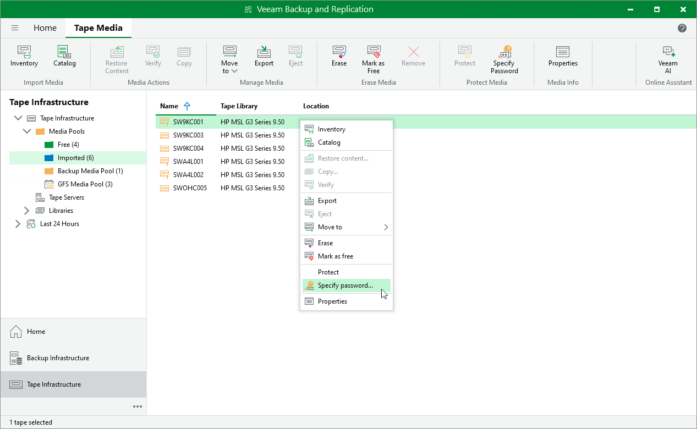

# Decrypting Tapes with Password

Tapes can be decrypted automatically or manually.

Decrypting Tapes Automatically

If you encrypt data encryption keys with secret keys, tapes are decrypted automatically only when the following conditions are met:

* You encrypt and decrypt the tape on the same backup server that uses the same configuration database.
* The tape is loaded to the tape library and information about this tape is available in the catalog.
* The password specified in the settings of the media pool to which the tape belongs is the same as the password that was used for tape encryption.
* The backup is not removed from the Veeam Backup & Replication console.

Decrypted backup files appear under the Backups > Tape node in the inventory pane. After that, you can perform restore operations for data archived to tape as usual.

In other cases, you need to decrypt tapes manually.

Decrypting Tapes Manually

To decrypt tapes manually, do the following:

1. Insert encrypted tapes into the tape library.
2. Catalog the tapes. Encrypted tapes will be marked with the key icon and displayed under the Media Pools > Imported node in the tape library.
3. In the working area, select the imported tape and click Specify Password on the ribbon. Alternatively, you can right-click the tape and select Specify password.

1. In the Password field, enter the password  you specified in the encryption options of the media pool. If you enter a correct password, Veeam Backup & Replication will decrypt the tape media.

Consider the following:

* If you import a backup file that was encrypted twice, you will need to subsequently do the following:

* To decrypt the tape, specify a password for the initial media pool used as a target in the backup to tape job. Backups from the tape will be displayed under the Backup > Tape (Encrypted) node in the inventory pane.
* Specify a password for the initial backup job to decrypt the backup and get access to its content.

For more information, see [How Double Data Encryption Works](encryption_tape.md#double_encryption_hiw).

* If a password has changed several times or you have switched between encryption methods, you will need to do the following:

+ If you catalog all tapes in the media pool including the last tape at a time, you must specify only the latest password that was used to encrypt data encryption keys. It will decrypt all tapes regardless of the previously used passwords.
+ If you catalog specific tapes in the media pool, you must specify the password that was used to encrypt data encryption keys for this specific tape.

* If you have lost or forgotten a password, you can issue a request to Veeam Backup Enterprise Manager and restore data from encrypted tapes using Enterprise Manager keys. This option works only if the password loss protection is enabled. For more information, see [Decrypting Tapes With Enterprise Manager Keys](tape_decrypt_no_password.md).
* If the imported tape is a part of a backup set but is not the last tape in this set, after you decrypt the type media, perform catalogization once again.

