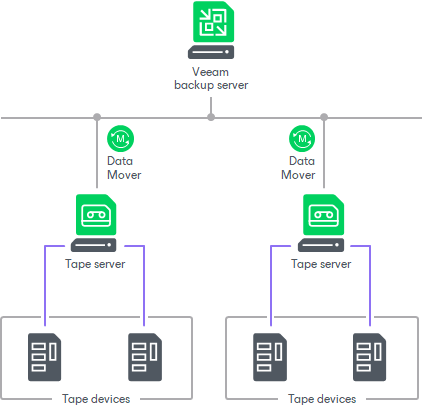

# Tape Devices Deployment

To connect tape devices to Veeam Backup & Replication, you need to deploy a tape server. Tape servers are network appliances that connect tape libraries to the Veeam backup server and manage traffic between tape devices and Veeam backup server. The connected tape devices are recognized by the Veeam Backup & Replication automatically.

Data Movers

With Veeam Backup & Replication, the data transfer during archiving and restore processes is enabled with Veeam Data Movers. Veeam Data Movers run on tape servers and other components of backup infrastructure. They receive tasks from the Veeam backup server and communicate to each other to transfer the data.

Veeam Data Movers are light-weight services that take a few seconds to deploy. Deployment is fully automated: when you assign a tape server role to a server, Veeam Backup & Replication installs the necessary components on this server and starts the required services on it.

Related Topics

[Connecting Tape Devices](connecting_tape_devices.md)

