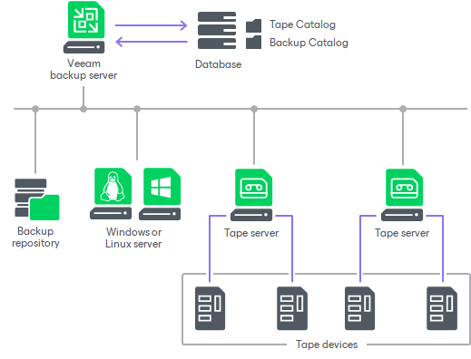

# Tape Environment

To administer tape backup and restore procedures, you must add the tape server to your Veeam Backup & Replication console. Adding the tape server to the backup infrastructure makes possible to transfer data between the disk storage and the tape archive.

The tape backup and restore process involves the following components:

Veeam Backup Server

The Veeam backup server is the server running Veeam Backup & Replication. It is the core component in the backup infrastructure. The Veeam backup server tasks include the following operations:

* Recognizing all tape devices that are connected to it and managing all drives, slots and tapes.
* Administering tape archiving: scheduling and triggering tape jobs and initiating restore tasks.
* Communicating with the Veeam configuration database.

Tape Device

When connected to the Veeam backup server, tape devices provide reading and writing capabilities, while all administration is performed by the Veeam backup server. You can connect multiple tape devices.

Tape Servers

To connect to the tape devices, Veeam Backup & Replication uses tape servers.

The tape server is a backup infrastructure component transferring data between data source and tape device. The tape server runs Veeam Data Mover that creates a communication point over which the data between the tape device and backup repositories or file servers is transferred.

The tape server deployment is fully automated: to create a tape server, you must assign the tape server role to a necessary server in the backup infrastructure. Note that Veeam Software Appliance and [Veeam Infrastructure Appliance](linux_infrastructure_appliance_install.md) cannot be used as a tape server.

Veeam Backup Database

Veeam Backup & Replication catalogs information about all archived data and stores this information in the Veeam backup database.

The registered tapes stay in the database until you remove the information about them. You can always view details for each tape, for example, information about backups written to it, even if the tape is not inserted in the library.

The catalog lets you quickly detect location of the required items on tape. The catalog correlates the archived files and their restore points to the names of the tapes, both online or offline, and the names of the media sets within which the data was written. When you start restoring data, Veeam Backup & Replication prompts for the tapes you need to bring online. As a result, you can restore data from tape much quicker when necessary.

Veeam Backup & Replication uses the following catalogs for storing the tape-related data:

* Tape Catalog stores information about files/folders archived to tape media with file to tape jobs, as well as backup files produced by backup to tape jobs. The content of the Tape Catalog can be examined in the Files view.
* Backup Catalog stores information about machines whose backups are archived to tape media with backup to tape jobs. The content of the Backup Catalog can be examined under the Backups > Tape node in the Home view.

Backup Repositories and File Servers

When retrieving data to back up, or restoring data to disk, Veeam Backup & Replication can connect to any machine that has been added as a managed server to the Veeam Backup & Replication console.

