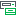
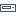
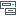
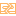
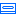
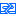

# Tape Infrastructure Icons

The user interface indicates states of the tape infrastructure components.

Tape Libraries

| Icon | Component state |
| --- | --- |
|  | Connected tape library |
|  | Tape library connected over SCSI |
|  | Tape library in the maintenance mode |

Drives

| Icon | Component state |
| --- | --- |
|  | Enabled tape drive |
|  | Disabled tape drive |
|  | Standalone tape drive |
|  | Disabled standalone tape drive |

NDMP Servers

| Icon | Component state |
| --- | --- |
|  | NDMP server |
|  | NDMP cluster |

Media Pools

| Icon | Component state |
| --- | --- |
|  | Free media pool |
|  | Imported media pool |
|  | Unrecognized media pool |
|  | Retired media pool |
|  | Media pool |
|  | GFS media pool |
|  | WORM media pool |
|  | WORM GFS media pool |

Online Tapes

| Icon | Component state |
| --- | --- |
|  | Tape |
|  | Retired tape |
|  | Encrypted tape |
|  | Software or hardware protected tape |
|  | Software or hardware protected and encrypted tape |

Online WORM Tapes

| Icon | Component state |
| --- | --- |
|  | WORM tape |
|  | Retired WORM tape |
|  | Encrypted WORM tape |
|  | Software or hardware protected WORM tape |
|  | Software protected and encrypted WORM tape |

Offline Tapes

Offline indication does not differ for standard and WORM tapes.

| Icon | Component state |
| --- | --- |
|  | Tape |
|  | Retired tape |
|  | Encrypted tape |
|  | Software or hardware protected tape |
|  | Software or hardware protected and encrypted tape |

Cleaning Tape

| Icon | Component state |
| --- | --- |
|  | Online cleaning tape |
|  | Offline cleaning tape |
|  | Retired online cleaning tape |
|  | Retired offline cleaning tape |

Files on Tapes

| Icon | Component state |
| --- | --- |
|  | Partially archived file (some file elements are missing) |

