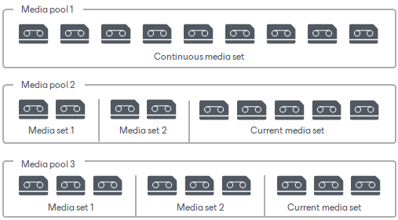

# Media Sets

Media set is a set of tapes used for continuously writing backup data. Media set is one of the parameters in media pool configuration.

A new media set always starts with a free tape. Within one media set, the new data block is appended to a previous one on a tape. Veeam Backup & Replication stores information about all tapes that belong to each media set. You can view the list of names or barcodes of tapes that are associated with a particular media set.

Media sets are used to explicitly distinguish data recorded to particular sets of tapes. You can choose between the following configuration options:

* Always continuing one media set. Use this option if you do not need to split your tape archives into separate sets of tapes.
* Creating a new media set for every backup session. In this case, Veeam Backup & Replication will produce a separate set of tapes for each new tape backup session.
* Starting a new media set for a certain period of time, for example, each week. As a result, you will have a separate set of tapes containing all backups that have been written to tape during a week.

When planning media sets configuration, you should balance between convenient viewing of data and efficiency of using the tapes. Media sets help create distinct packs of tapes, which will be convenient, for example, if you need to bring certain tapes from an offsite storage location to restore data. However, it may use the tapes ineffectively as the new media sets always require a new tape. This option is helpful when you have a lot of backups stored offsite.

Always continuing one media set option is most efficient in terms of tape capacity usage, for the new data will be written to the same tape until it is full. However, in this case the data will be split across tapes and you may require a larger number of tapes to get a particular backup set for restore. This option is usually used in environments where the tapes are not exported from libraries.

In some cases, Veeam forcibly starts a new media set, even if media pool settings do not instruct Veeam to do so. It happens when a job starts, but the tape that was planned for writing data cannot be used. In this situation, Veeam takes a new tape, and starts a new media set on it. For example, the situation may be as following:

1. The required tape is offline. If you bring such tape online before the tape job starts, it will be used as planned.
2. A backup to tape job is scheduled to export tapes from the media pool upon job completion. Exporting closes the current media set and starts a new one on the next job run.
3. The required tape is hardware or software protected.
4. In library failover on the following events: library is offline and all drives are busy. When a tape library is failed over on these events, Veeam Backup & Replication starts a new media set even if the global media pools are configured to always continue one media set.

Note that if a new media set is started, scheduled or forced, the previous media set cannot be resumed.

