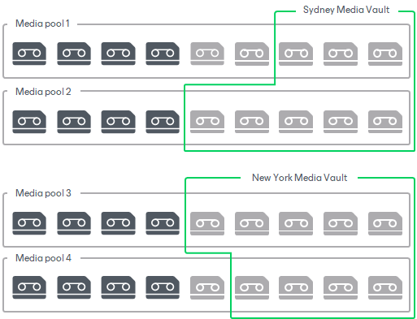

# Vaults

Vaults are logical containers that help you to additionally organize offline tapes. When the tapes are recorded and moved offsite, you need to have easy ways to manage data on such tapes.

Vaults visualize information about tapes. They store information about original location of tapes, such as library and media pool, data written to tapes and retention terms for it. Vaults are not limited to any original location of tapes: you can place tapes from different libraries and media pools to one vault.

You can virtually move tapes to the vaults grouping them by any criteria. For example, if you have several offsite storage locations for physical tapes, you can create a vault for each of them. When you transport the physical tapes to the offsite storage, you can move the offline tapes to a vault in your Veeam backup console mirroring the physical storage. This will allow you to have convenient representation of the list of tapes in each of your physical storage locations.

Tapes can be moved to a vault automatically if you instruct media pools to move tapes to a selected vault after the tapes go offline. You can also move the tapes from one vault to another. Tapes will not be shown in their vault when you bring them online. The tapes that have been moved to a vault stay visible in their media pools and under the Offline node. When you remove a tape from the Veeam backup server, it is automatically deleted from the vault.

To start working with vaults, you need to create one or more of them. Vaults are virtual container, and do not require any physical resources.

|  |
| --- |
| Note |
| You can work with tape vaults if Veeam Backup & Replication Enterprise license or higher is installed on the Veeam backup server. |

Related Topics

* [Creating Vaults](creating_media_vaults.md)
* [Modifying Vaults](managing_media_vaults.md)
* [Removing Vaults](removing_media_vault.md)
* [Moving Tapes to Vault](placing_tapes_to_vault.md)
* [Managing Tapes in Vault](managing_tapes_in_vault.md)

See Also

[Managing Locations](locations.md)

