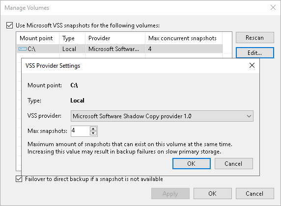
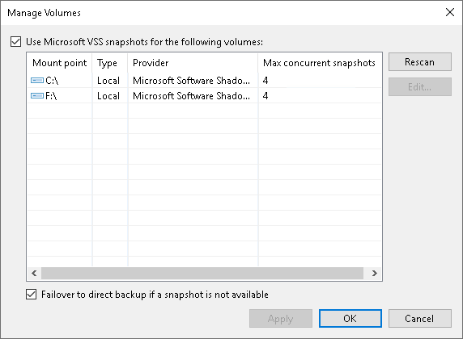

# Step 7. Specify Settings for Connected Volumes

|  |
| --- |
| Note |
| This feature is available for Windows-based servers only. |

Before you specify settings for a managed server added as a file server, you must rescan its volumes. During volume rescan, Veeam Backup & Replication retrieves information about disks and volumes that are currently connected to the server and writes this information to the configuration database.

Veeam Backup & Replication automatically performs volume rescan every 4 hours. You can also start volume rescan manually:

1. Open the Backup Infrastructure view.
2. In the inventory pane, select Managed servers.
3. In the working area, select the server and click Rescan on the ribbon. Alternatively, you can right-click the host and select Rescan.

After you add a managed server as a file server to the inventory of the virtual infrastructure, you can configure the following settings for it:

* Specify volume-specific settings.
* Enable or disable failover to direct backup if a snapshot is not available.

Volume-Specific Settings

You can define volume-specific settings for the file server: select what VSS provider must be used for snapshot creation and specify the maximum number of concurrent snapshots that must exist for the volume.

To specify volume-specific settings:

1. Open the Inventory view.
2. In the inventory pane, select Unstructured Data – File Servers.
3. In the working area, select the server and click Manage Volumes on the ribbon. Alternatively, you can right-click the managed server and select Manage volumes.
4. Select the volume in the list and click Edit.
5. Specify VSS provider settings for the volume:

* To take a VSS snapshot of a specific volume, Veeam Backup & Replication uses one of VSS providers available for this volume. To explicitly define what VSS provider must be used for the volume, select the VSS provider from the VSS provider list.
* You can simultaneously store 4 snapshots of one volume. To change this number, specify the Max snapshots value. It is not recommended that you increase the number of snapshots for a slow storage. Many snapshots existing at the same time may cause VM processing failures.

1. Click OK to save the changes.

Failover to Direct Backup Settings

If snapshots for volumes are not available, Veeam Backup & Replication may automatically fail over to direct backup.

By default, the failover option is enabled. To disable failover to direct backup:

1. Open the Inventory view.
2. In the inventory pane, select Unstructured Data – File Servers.
3. In the working area, select the server and click Manage Volumes on the ribbon. Alternatively, you can right-click the managed server and select Manage volumes.
4. In the Manage Volumes window, clear the Failover to direct backup if a snapshot is not available check box.

|  |
| --- |
| Important |
| We do not recommend to clear the Failover to direct backup if a snapshot is not available check box, as it may result in the file backup job failure if a snapshot is not available for the volume. |

