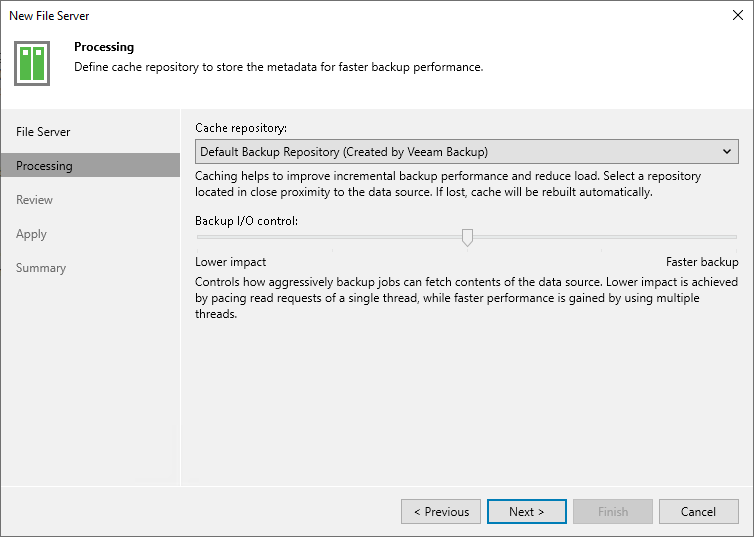

# Step 3. Specify File Server Processing Settings

In this article

At the Processing step of the wizard, define file server processing settings:

1. From the Cache repository drop-down list, select a cache repository where temporary cache files must be stored. This repository must be located as close to the source file share as possible.
2. Use the Backup I/O control slider to define how fast the backup proxy can read data from the source file server. This setting is based on the number of parallel threads that can be used by the proxy configured for processing the file server. If resources of your file server are limited, it is recommended that you select the Lower impact option. If your file server is powerful enough, select the Faster backup option.
3. Click Next to save the configured settings.

Page updated 11/3/2023

Page content applies to build 13.0.1.1071
