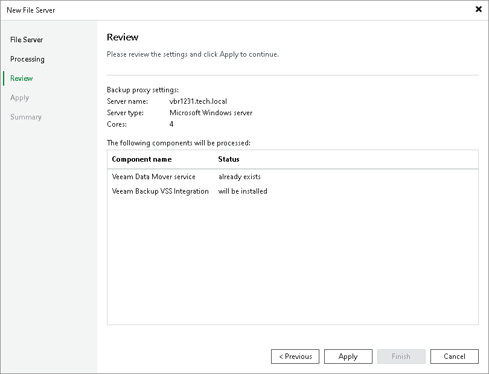

# Step 4. Review Components to Install

In this article

At the Review step of the wizard, review what Veeam Backup & Replication components are already installed on the server and click Apply to start installation of missing components.

Page updated 11/3/2023

Page content applies to build 13.0.1.1071
