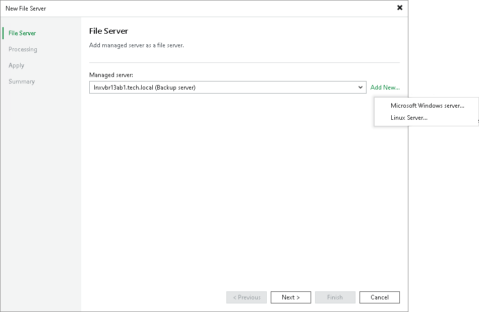

# Step 2. Add Managed Server

In this article

At the File Server step of the wizard, choose the server, which you want to use as a file share server. Select it from the Managed Server drop-down list.

|  |
| --- |
| Note |
| If you plan not only to back up the Linux-managed file server, but also to restore files to it, use an account with root access when adding the server to the backup infrastructure. |

If the drop-down list does not display the required server, you must add it to the backup infrastructure. To add the server, do the following:

1. Click Add New.
2. Select Microsoft Windows Server or Linux Server.
3. Add a new Windows or Linux server to the backup infrastructure as described in the [Adding Microsoft Windows Servers](https://helpcenter.veeam.com/docs/backup/vsphere/add_windows_server.html?ver=120) and [Adding Linux Servers](https://helpcenter.veeam.com/docs/backup/vsphere/add_linux_server.html?ver=120) sections.
4. Select the newly added server from the Managed Server drop-down list.

Page updated 11/3/2023

Page content applies to build 13.0.1.1071
