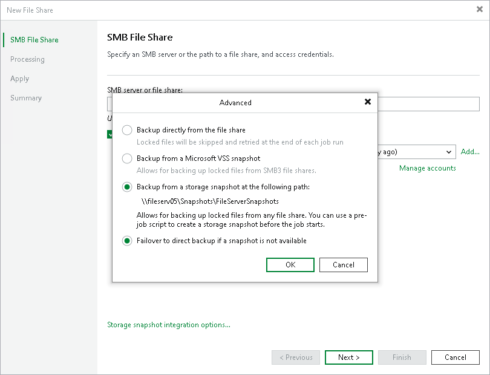

# Step 3. Specify Advanced SMB File Share Settings

You can instruct Veeam Backup & Replication to back up data from Microsoft VSS snapshots or native storage snapshots. During backup jobs, Veeam Backup & Replication will read data of shared files and folders from snapshots, which speeds up backup operations and improves RPOs.

To define if Veeam Backup & Replication will use snapshots for backups:

1. At the SMB File Share step of the wizard, click Storage snapshot integration options.
2. In the Advanced window, select one of the following options:

* To ignore the snapshot functionality, select Backup directly from the file share.

Veeam Backup & Replication will ignore locked files and folders. When creating a backup job, you can configure notifications to list files and folders that are skipped during the backup procedure. For more information see the [Notification Settings](https://helpcenter.veeam.com/docs/vbr/userguide/file_share_backup_job_advanced_notifications.html?ver=13) section.

* To back up files from Microsoft VSS snapshots, select Backup from a Microsoft VSS snapshot.

If you select this option, make sure that the file share and the backup proxy used for the file backup job support SMB protocol version 3.0 or later.

* To back up files from the native storage snapshot, select Backup from a storage snapshot at the following path and specify the path in the \\server\snapshotfolder\snapshotname format to the snapshot stored on the SMB file share. You can specify the IPv4 or IPv6 address of the server. Note that you can use IPv6 addresses only if IPv6 communication is enabled as described in the [IPv6 Support](https://helpcenter.veeam.com/docs/vbr/userguide/ipv6.html?ver=13) section.

If you select this option, you can additionally use custom scripts written by you, for example, to create a snapshot before the backup and remove it after the backup. You can define these scripts when creating a new file backup job, as described in the [Script Settings](https://helpcenter.veeam.com/docs/vbr/userguide/file_share_backup_job_advanced_scripts.html?ver=13) section.

|  |
| --- |
| Note |
| Consider that Veeam Backup & Replication does not take snapshots itself, but it can use a snapshot taken by the storage system. File backup jobs do not trigger the storage snapshot creation and deletion automatically. You can specify the folder where the storage snapshot is stored. In this case file backup jobs can access this folder and read data from the storage snapshot. |

1. Select Failover to direct backup if snapshot is not available if you want Veeam Backup & Replication to read data for backup directly from the file share when the snapshot is unavailable. If you do not select the option and the snapshot is unavailable, the file backup job will stop with a failure.

