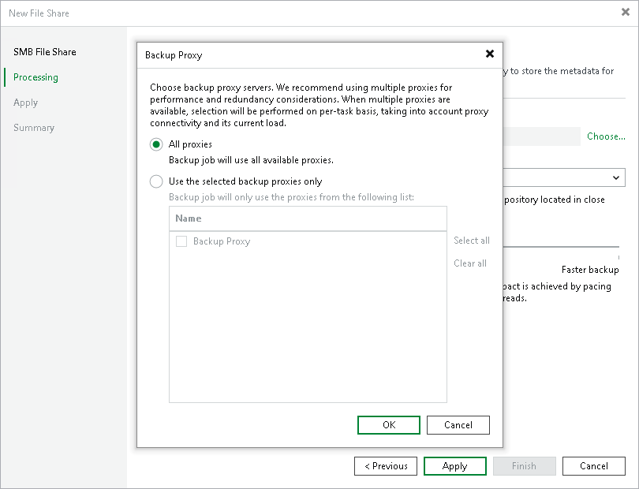
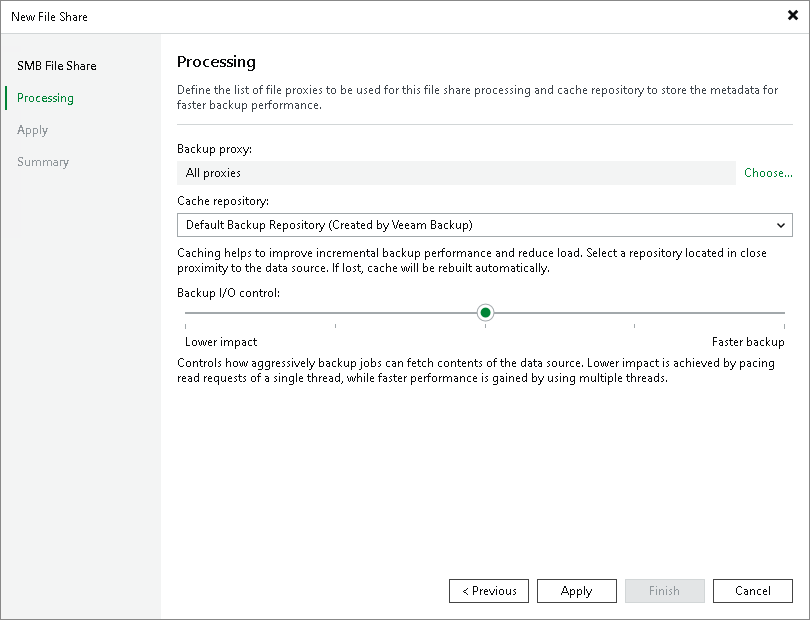

# Step 4. Specify File Share Processing Settings

In this article

At the Processing step of the wizard, do the following:

1. Click Choose next to the Backup proxy field to select a backup proxy.
2. In the Backup Proxy window, select proxy servers:

* If you select All proxies, Veeam Backup & Replication will use all available backup proxies for file backup. The number of proxies in use defines the number of data threads that transfer data from the file share to the backup repository. The more data transfer threads Veeam Backup & Replication uses, the higher is the data transfer speed.

If the file share is used as a source for a file to tape backup job, the tape server utilized for this job is added as yet another backup proxy when creating a file to tape backup job. This backup proxy has the highest priority over all others and is used by default if it has access rights to the file share. For details on file to tape backup jobs, see [File Backup to Tape](file_to_tape_jobs.md).

* If you select Use the selected backup proxies only, you can explicitly specify backup proxies that Veeam Backup & Replication must use for file backup.

It is recommended that you select at least two backup proxies to ensure that the backup jobs start even if one of the proxies fails or loses its connectivity to the source file share. The more proxies you select, the more data transfer threads Veeam Backup & Replication will use for backup jobs, thus improving performance.

Even if the file share is used as a source for file to tape backup jobs, Veeam Backup & Replication will use only proxies selected in the list to process the backup data traffic.

1. From the Cache repository drop-down list, select a cache repository where temporary cache files must be stored. This repository must be located in the close proximity to the source file share and backup proxies.

1. Use the Backup I/O control slider to define how fast all proxies can read data from the source file share. This setting is based on the number of parallel threads that can be used by all the proxies configured for processing the file share. If resources of your NAS device are limited, it is recommended that you select the Lower impact option. If your NAS device is powerful enough, select the Faster backup option.

1. Click Apply to save the configured settings.

Page updated 3/20/2025

Page content applies to build 13.0.1.1071
