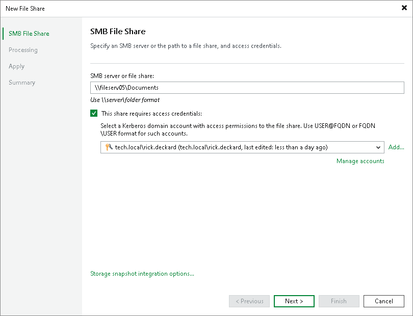

# Step 2. Specify Path to SMB File Share and Access Credentials

In this article

At the SMB File Share step of the wizard, specify access settings for the SMB file share:

1. In the SMB server of file share field, specify the path to an SMB file share in the \\server\folder format. You can specify the IPv4 or IPv6 address of the server. Note that you can use IPv6 addresses only if IPv6 communication is enabled as described in the [IPv6 Support](ipv6.md) section.

You can also click Browse and select the shared folder from the list of available network shares.

1. If you must specify user credentials to access the shared folder, select the This share requires access credentials check box. From the Credentials drop-down list, select a credentials record for a user account that has Full Control permissions on the shared folder.

To access the SMB share, you must use an account that meets either of the following requirements:

* If you only plan to back up the share, you can use an account with read-only permissions.
* If you plan not only to back up the share, but also to restore files to it, use an account with read/write permissions.

|  |
| --- |
| Note |
| Accessing the SMB file share with credentials in the User Principal Name format (user@domain.xxx) is not supported. |

If you have not set up credentials beforehand, click the Manage accounts link at the bottom of the list or click Add on the right to add the credentials. For more information, see the [Managing Credentials](https://helpcenter.veeam.com/docs/backup/vsphere/managing_credentials.html?ver=120) section.

|  |
| --- |
| Note |
| If the This share requires access credentials check box is not selected, Veeam Backup & Replication uses the computer account of the proxy server to access the file share. |

Page updated 5/21/2025

Page content applies to build 13.0.1.1071
