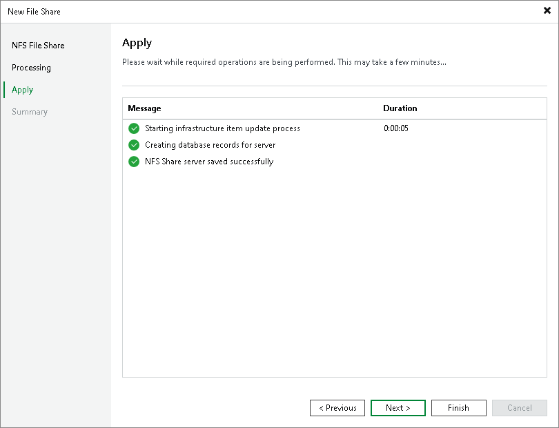

# Step 5. Apply File Share Settings

In this article

At the Apply step of the wizard, wait till Veeam Backup & Replication installs and configures all required components and adds the NFS file share to the backup infrastructure. Click Next to proceed.

Page updated 11/3/2023

Page content applies to build 13.0.1.1071
