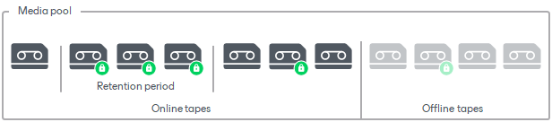

# Tape Protection

Tape protection is a software option that prohibits overwriting, erasing or appending data to protected tape. You can protect individual tapes that, for example, contain particularly valuable data.

Tape protection overrides retention settings of the media pool. The retention of other tapes in the media pool is not modified. You can remove the protection at any time. The tape will return to the retention period set by the media pool. If the media pool retention expired during the time the tape was protected, the tape will be queued for overwriting.

You can set protection for any tape, online or offline, that contains data. If the offline tape is in a media vault, the media vault will update the Protected status for this tape automatically.

When the tapes are protected, the following operations are prohibited for them:

* Appending data to tapes
* Erasing tapes
* Marking tapes as free
* Removing tapes from catalog

To perform these operations, you need to switch the protection off first.

Related Topics

[Protecting Tapes](protecting_tapes.md)

