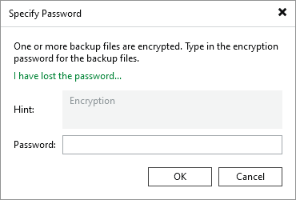
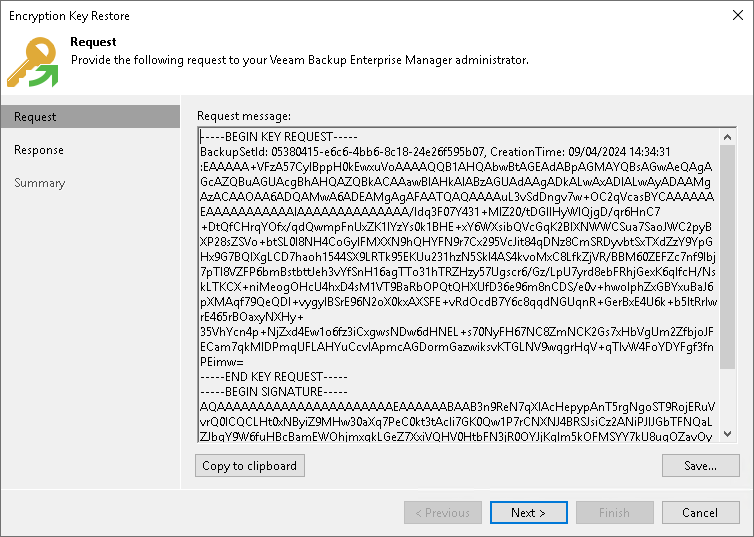

# Step 1. Create Request for Key Restore

In this article

This procedure is performed by the Veeam Backup Administrator on the backup server.

To create a request for key restore, do the following:

1. Import encrypted tapes to the backup server.
2. Select the imported tape and click Specify Password on the ribbon. Alternatively, you can right-click the tape and select Specify password.
3. In the Specify Password window, click the I have lost the password link. Veeam Backup & Replication will launch the Encryption Key Restore wizard.

1. At the Request step of the wizard, review the generated request for data recovery. Copy the request to the clipboard or save it to a text file.
2. Send the copied request by email or pass it in any other way to the Veeam Backup Enterprise Manager Administrator.

|  |
| --- |
| Tip |
| You can close the Encryption Key Restore wizard on the Veeam backup server and start it anew when you receive a response from the Veeam Backup Enterprise Manager Administrator. |

Page updated 5/21/2025

Page content applies to build 13.0.1.1071
