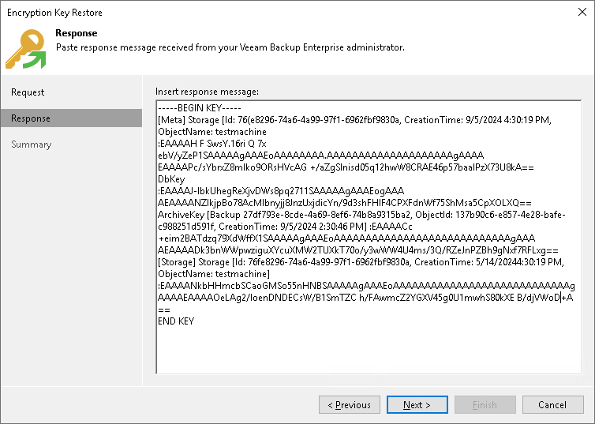

# Step 3. Complete Key Restore Process

In this article

This procedure is performed by the Veeam Backup Administrator on the backup server.

1. In Veeam Backup & Replication, return to the Encryption Key Restore wizard.
2. Enter the copied response to the text window at the Response step of the Encryption Key Restore wizard.
3. Follow the next steps of the wizard. At the last step, click Finish. Veeam Backup & Replication will retrieve the information required for decryption from the response, apply it to the encrypted tape and unlock the tape content.

Page updated 5/20/2025

Page content applies to build 13.0.1.1071
