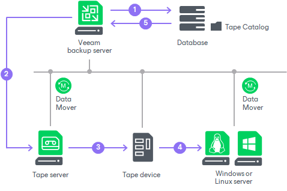

# How Restoring Files from Tape Works

When Veeam Backup & Replication restores files archived to tape, it performs the following operations:

1. Veeam Backup & Replication checks the Tape Catalog in the Veeam Backup & Replication database to discover the tapes containing the needed restore point of the files. If the tapes are offline, Veeam Backup & Replication prompts the user to insert the required tapes.
2. Veeam Backup & Replication connects to Veeam Data Mover deployed on a tape server.
3. Veeam Data Mover copies the relevant files from the tapes.
4. The copied files are transferred to a chosen target location, same or new one. If the target location is a file share, the role of the gateway server can be assigned to different components depending on the file share configuration:

* In case the file share has automatic gateway selection enabled, the role of the gateway server is assigned to the tape server.
* If you explicitly specify gateway servers for the file share, Veeam Backup & Replication uses only gateway servers selected in the list.

1. Veeam Backup & Replication updates the Tape Catalog in the Veeam Backup database.

