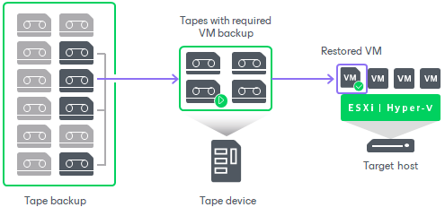
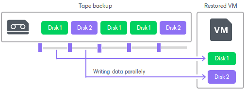
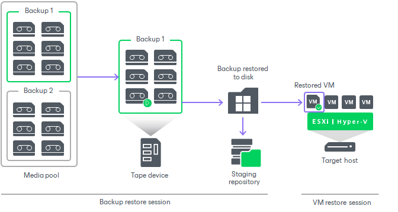

# How Restoring VM from Tape to Infrastructure Works

Restore Directly to Infrastructure

For each VM, Veeam starts a separate restore job. However, you can select multiple VMs to restore: in this case, Veeam will queue the restore jobs and run them one after the other.

For restoring a VM directly to the infrastructure, Veeam Backup & Replication performs the following steps:

1. The VM from tape restore job checks the Backup Catalog in the Veeam Backup & Replication database to discover the tapes containing the needed backup files. If the tapes are offline, Veeam Backup & Replication prompts the user to insert the required tapes.

Veeam needs to load and read the selected tapes 3 times.

1. Veeam loads the tapes for the 1st time.
2. Veeam reads metadata and caches it on the tape server. This requires approximately 100Mb of disk space per 1TB of tape data for the default data block size.
3. Using the cached data, Veeam builds a map of data blocks. The map contains referenced to the data blocks of the VM you restore: the VM configuration file and the VM disks data.
4. Veeam loads the tapes for the 2nd time.
5. Veeam restores the VM configuration:

* To restore to original location, Veeam synchronizes the VM configuration file up to the backup state.
* To restore to another location, Veeam copies the VM configuration file and registers the VM on the target host.

1. Veeam loads the tapes for the 3rd time.
2. Veeam restores the VM disks. Multiple disks are restored parallelly. Veeam reads the tape consequently and, using the map of data blocks, copies the VM disks data.

Restore Through Staging Repository

For restoring through a staging repository, Veeam Backup & Replication performs the following steps:

1. Veeam starts 2 jobs at background:

* Backup restore job: temporarily restores the backup to the repository.
* VM restore job: restores the VM to the infrastructure.

The jobs start simultaneously. The VM restore job starts and remains pending until the backup restore completes.

1. The backup restore job checks the Backup Catalog in the Veeam Backup & Replication database to discover the tapes containing the needed backup. If the tapes are offline, Veeam Backup & Replication prompts the user to insert the required tapes.
2. The backup restore job reads the tapes consecutively and copies the backup to the selected staging repository or folder.
3. When the backup is copied, Veeam registers it temporarily as an imported backup.
4. The backup restore job finishes.
5. The VM restore job receives information about the backup restored successfully and launches a standard VM restore process. For more information, see [Entire VM Restore](full_recovery.md).
6. When the VM is successfully restored, the VM restore process finishes.
7. Veeam deletes the backup from the staging repository and from disk.

