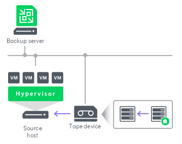

# Restoring Data from Encrypted Tapes

In this article

To perform operations with backup files, you need to decrypt tapes first. Veeam Backup & Replication transfers encrypted data to the source side and performs data decryption.

For more information, see the following sections:

* [Decrypting Tapes with KMS Keys](tape_decrypt_kms.md)
* [Decrypting Tapes with Password](tape_decrypt_password.md)
* [Decrypting Tapes With Enterprise Manager Keys](tape_decrypt_no_password.md)

Page updated 11/5/2025

Page content applies to build 13.0.1.1071
