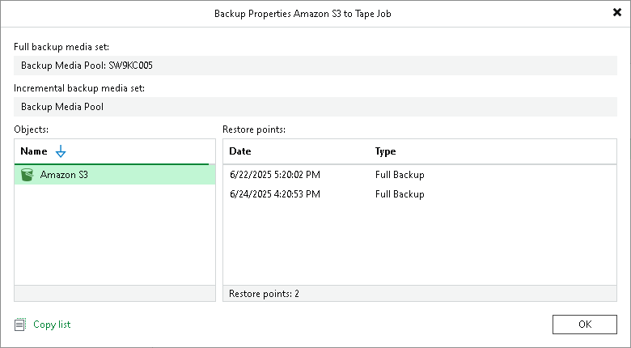

# Viewing Unstructured Data Backup Properties

You can view summary information about a selected object to tape or file backup to tape job. The summary information provides the following data:

* Name of the media pool and tapes that store full backups of files or object storage data.
* Name of the media pool and tapes that store incremental backups of files or object storage data.
* Backup source.
* Available restore points: date of their creation and their type (Full or Incremental).

You can restore files or object storage data to the state as of any of these points. To learn how to restore files and objects from tape, see [File Restore from Tape](file_restore_from_tape.md) and [Object Restore from Tape](object_restore_from_tape.md).

To view summary information for backups:

1. Open the Home view.
2. In the Inventory pane, select Backups > Tape.
3. In the working area, right-click the backup to tape job and select Properties.
4. To see the list of available restore points, select the required object from the Objects list.

