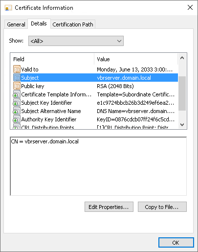
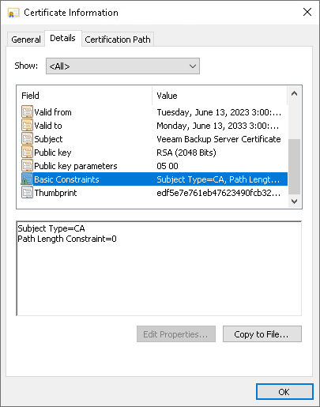
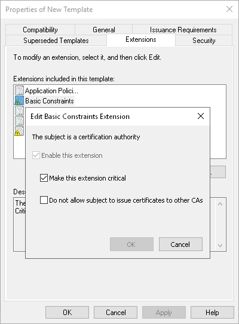

# Using Certificate Signed by Internal CA

If you want to use a certificate signed by an internal Certificate Authority (CA), consider the following:

* The Veeam Backup & Replication server must trust the CA:

* If you use Veeam Backup & Replication on Microsoft Windows, you must add the certificate to the Trusted Root Certification Authority store.
* If you use Veeam Backup & Replication on Linux, you must add the certificate to the /etc/pki/ca-trust/source/anchors/ directory in the .pem format and run update-ca-trust extract as the root account.

* The Certificate Revocation List (CRL) must meet the following requirements:

* It must be accessible from the Veeam Backup & Replication backup server.
* It must have an http endpoint.
* It must be signed with a strong cryptographic algorithm such as RSA-SHA256.

* If you use Windows Server Certification Authority, issue a Veeam Backup & Replication certificate based on the built-in Subordinate Certification Authority template or templates similar to it. You can manage templates with the Certificate Templates MMC snap-in.
* [For Linux-based Veeam Agent computers] OpenSSL version 1.0 or later must be installed on the Veeam Agent computer.

|  |
| --- |
| Important |
| The following certificates are not supported:   * Certificates issued by public CAs * Elliptic Curve Signature (ECC) certificates * Cryptography API: Next Generation (CNG) certificates |

A certificate signed by a CA must meet the following requirements:

* The certificate subject is equal to the fully qualified domain name of the Veeam Backup & Replication server. For example: vbrserver.domain.local.

* The Subject Alternative Name field contains both the FQDN and the NetBIOS name. You can add multiple DNS entries in the following format: DNS:vbrserver.domain.local,DNS:vbrserver.

* The minimum key size is 2048 bits.
* The following key usage extensions are enabled in the certificate:

+ Digital Signature
+ Certificate Signing
+ Off-line CRL Signing
+ CRL Signing (06)

* The Path Length Constraint parameter in the Basic Constraints extension is set to 0.
* The Subject Type parameter in the Basic Constraints extension is set to CA.

If you use Windows Server Certification Authority, open the Certificate Templates MMC snap-in and select the certificate template based on the built-in Subordinate Certification Authority template or templates similar to it. On the Extensions tab, enable the Do not allow subject to issue certificates to other CAs option.

* The key type in the certificate is set to Exchange.

To start using the signed certificate, you must select it from the local certificate store on the Veeam Backup & Replication server or import it as a .pfx file. To learn more, see [Importing Certificate from Certificate Store](import_tls.md) and [Importing Certificate from PFX Files](import_tls_pfx.md).

