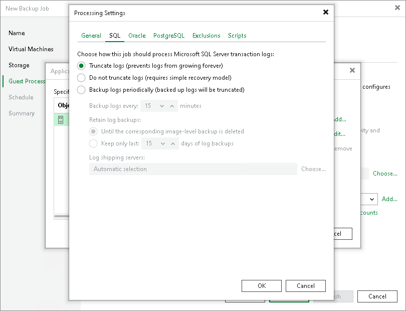

# Transaction Log Truncation

If you back up or replicate virtualized database systems that use transaction logs, for example, Microsoft Exchange or Microsoft SQL Server, you can instruct Veeam Backup & Replication to truncate transaction logs so that logs do not overflow the storage space on the VM. Veeam Backup & Replication provides the following options of transaction logs handling:

* [Truncate logs](#truncate)
* [Do not truncate logs](#not_truncate)
* [Back up logs periodically](#backup)

Truncate Logs

You can instruct Veeam Backup & Replication to truncate logs after a backup or VM replica is successfully created. With this option selected, Veeam Backup & Replication behaves in the following way:

* If the job completes successfully, Veeam Backup & Replication produces a backup file or VM replica and truncates transaction logs on the original VM. As a result, you have the backup file or replica that contains a VM image at a specific point in time.

In this scenario, you can recover a database to the point in time when the backup file or replica was created. As transaction logs on the VM are truncated, you cannot use them to get the restored database to some point in time between job sessions.

* If the backup or replication job fails, Veeam Backup & Replication does not truncate transaction logs on the VM. In this scenario, you can restore a VM from the most recent backup or replica restore point. Then, you can use database system tools to apply transaction logs and get the database system to the necessary point in time after the restore point.

Do not Truncate Logs

You can choose not to truncate transaction logs on the VM. This option is recommended if, together with Veeam Backup & Replication, you use another backup tool.

For example, you can use Veeam Backup & Replication to create a VM image backup and instruct the native Microsoft SQL Server log backup job to back up transaction logs. If you truncate transaction logs with Veeam Backup & Replication, the chain of transaction logs will be broken, and the Microsoft SQL Server log backup job will not be able to produce a consistent log backup.

With this option selected, Veeam Backup & Replication produces a backup file or VM replica and does not trigger transaction log truncation. As a result, you have a backup file or VM replica that contains a VM image captured at a specific point in time and transaction logs on the VM. You can use transaction logs to restore the VM to any point in time between job sessions. To do this, you must recover the VM from the backup file or perform a replica failover and use database system tools to apply transaction logs and get the database system to the necessary point in time.

Back Up Logs Periodically

This option can be used if you back up Microsoft SQL Server VMs and Oracle VMs.

You can choose to back up logs with Veeam Backup & Replication. For more information, see [Microsoft SQL Server Log Backup](sql_backup_hv.md) and [Oracle Log Backup](oracle_backup_hv.md).

Support for Database Availability Groups (DAG)

Veeam Backup & Replication supports any configuration of DAGs, in particular, with all databases active on one node, or with active databases on every node. Transaction logs will be truncated on all DAG members, regardless of whether Veeam Backup & Replication backs up an active or passive database.

For more information and recommendations on Microsoft Exchange Server backup, you can also refer to [this Veeam KB article](https://www.veeam.com/kb1744).

Related Topics

* [Copy-Only Backup](copy_only_hv.md)
* [Microsoft SQL Server Log Backup](sql_backup_hv.md)
* [Oracle Log Backup](oracle_backup_hv.md)
* [Creating Backup Jobs](backup_job_hv.md)
* [Creating Replication Jobs](replica_job_hv.md)

