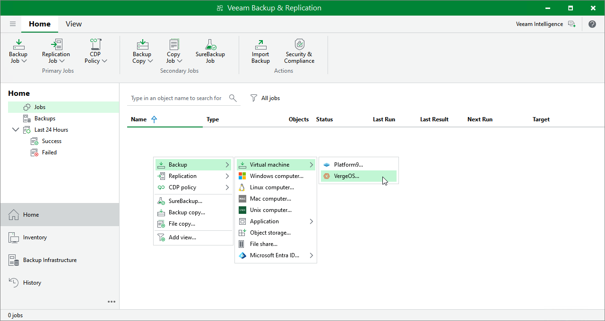

# Step 1. Launch New Backup Job Wizard

To launch the New Job wizard, do the following:

1. Open the Home view.
2. In the inventory pane, select Jobs.

1. Right-click the working area, select Backup > Virtual machine and choose the required hypervisor.

Alternatively, click Backup Job > Virtual machine and choose the required hypervisor on the ribbon.

|  |
| --- |
| Note |
| Currently, Veeam Plug-in for Universal Hypervisor API supports the VergeOS and Platform9 universal hypervisors. |

Page updated 2026-07-10

