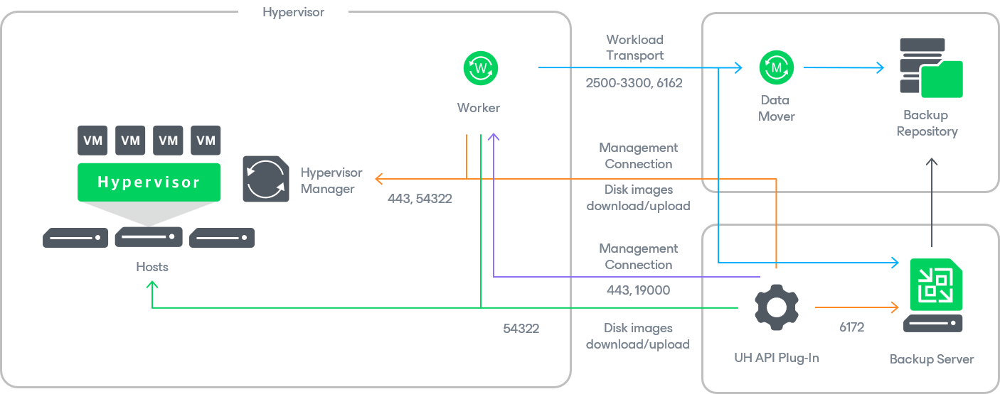

# Solution Architecture

Since Veeam Plug-in for Universal Hypervisor API is integrated with Veeam Backup & Replication, the solution architecture comprises the following set of components:

* [Universal Hypervisor Manager](#cluster)
* [Backup server](#server)
* [Veeam Plug-in for Universal Hypervisor API](#plugin)
* [Backup repositories](#repositories)
* [Workers](#workers)

Universal Hypervisor Manager

The Universal Hypervisor Manager is an application that leverages the oVirt REST API capabilities to manage VMs running on universal hypervisors. Veeam Plug-in for Universal Hypervisor API uses the Universal Hypervisor Manager to access such virtual resources as storage, networks, hosts and clusters while performing backup and restore operations. Currently, Veeam Plug-in for Universal Hypervisor API supports the VergeOS and Platform9 universal hypervisors.

For VergeOS, the Universal Hypervisor Manager is a software package that you must install on the hypervisor as described in [VergeOS documentation](https://docs.verge.io/automate-protect-and-extend/integrations-and-apis/veeam). For Platform9, the Universal Hypervisor Manager is a Linux-based VM that you must deploy on the hypervisor as described in [Platform9 documentation](https://docs.platform9.com/private-cloud-director/integrations/veeam-integration-with-pcd/veeam-backup-and-replication).

Backup Server

A backup server is either a Windows-based or Linux-based machine (either physical or virtual) on which Veeam Backup & Replication is installed. The backup server is the configuration, administration and management core of the backup infrastructure. It coordinates backup and restore operations, controls job scheduling and manages resource allocation.

Veeam Plug-In for Universal Hypervisor API

Veeam Plug-in for Universal Hypervisor API is an architecture component that enables integration between the backup server and other components of the backup infrastructure. Veeam Plug-in for Universal Hypervisor API allows Veeam Backup & Replication to connect to the Universal Hypervisor Manager, and to perform data protection and disaster recovery tasks with VMs running on a universal hypervisor.

Backup Repositories

A backup repository is a storage location where Veeam Backup & Replication stores backups of VMs running on a universal hypervisor.

To communicate with backup repositories, Veeam Backup & Replication uses Veeam Data Mover — the service that is responsible for data processing and transfer. By default, Veeam Data Mover runs on the repositories themselves. If a repository cannot host Veeam Data Mover, it starts on a gateway server — a dedicated component that “bridges” the backup server and workers. For more information, see [Gateway Servers](gateway_server.md).

Workers

A worker is a Linux-based VM that resides in the universal hypervisor cluster and processes backup workloads when transferring data to and from backup repositories.

Page updated 2026-07-30

