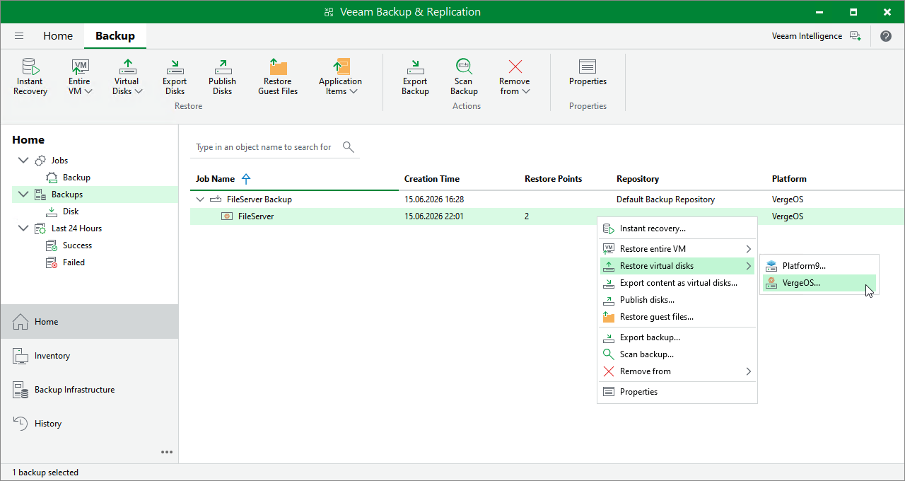

# Step 1. Launch Virtual Disk Restore Wizard

To launch the Virtual Disk Restore wizard, do the following:

1. In the Veeam Backup & Replication console, open the Home view.
2. In the inventory pane, select Backups.

1. In the working area, expand the necessary backup job, right-click the VM you want to restore, select Restore virtual disks and choose one of the hypervisors.

Alternatively, expand the necessary backup job, select the VM, click Virtual disks on the ribbon and then select the hypervisor.

|  |
| --- |
| Note |
| Currently, Veeam Plug-in for Universal Hypervisor API supports the VergeOS and Platform9 universal hypervisors. |

Page updated 2026-07-24

