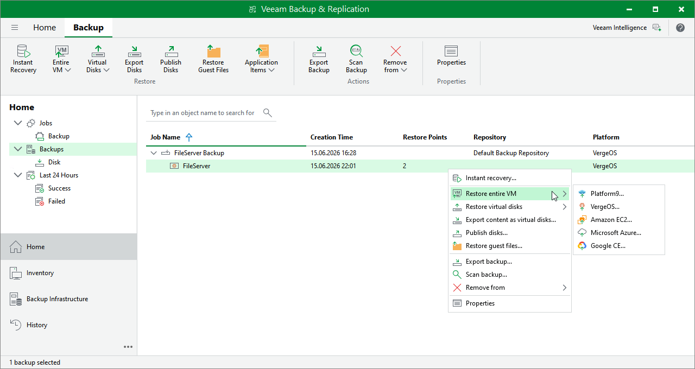

# Step 1. Launch Entire VM Restore Wizard

To launch the Full VM Restore wizard, do the following:

1. Open the Home view.
2. In the inventory pane, select Backups.
3. In the working area, expand the necessary backup job, right-click the VM you want to restore, select Restore entire VM and choose one of the hypervisors.

Alternatively, expand the necessary backup job, select the VM, click Entire VM on the ribbon and then select the hypervisor.

|  |
| --- |
| Note |
| Currently, Veeam Plug-in for Universal Hypervisor API supports the VergeOS and Platform9 universal hypervisors. |

Page updated 2026-07-10

