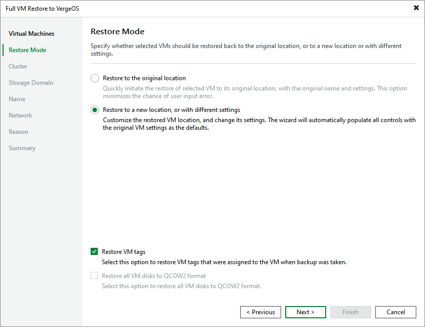

# Step 3. Choose Restore Mode

At the Restore Mode step of the wizard, choose whether you want to restore the selected VM to the original or to a custom location. You can also choose whether you want the recovered VM to be assigned the same tags as the original VM (if supported by the hypervisor).

|  |
| --- |
| Tip |
| If the hypervisor supports QCOW2 disks, you can instruct Veeam Plug-in for Universal Hypervisor API to restore disks attached to the recovered VM in the QCOW2 format. This will [increase speed and efficiency of incremental backups](uh_changed_block_tracking.md) further created for the VM. |

Page updated 2026-07-10

