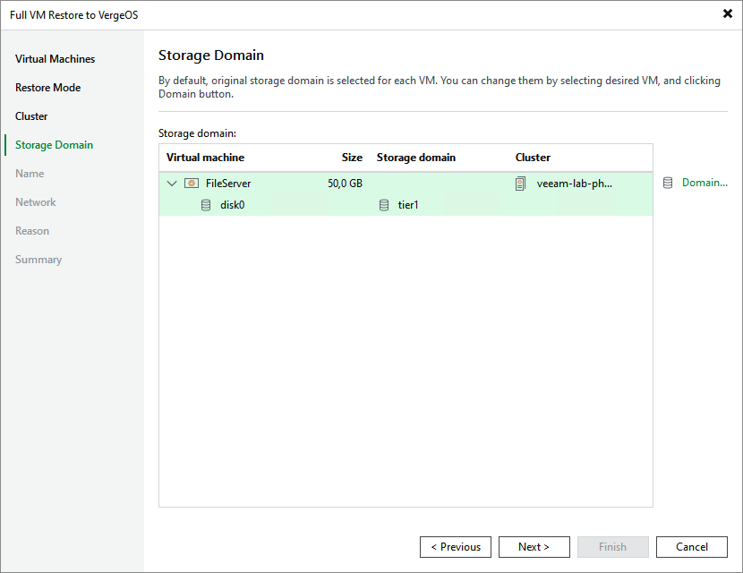

# Step 5. Select Storage Domain

[This step applies only if you have selected the Restore to a new location, or with different settings option at the Restore Mode step of the wizard]

At the Storage Domain step of the wizard, choose storage where virtual disks of the recovered VM will be stored.

If you restore the VM to the original host, Veeam Backup & Replication will automatically select the same storage where the original VM disks were stored at the moment of backup. If you restore the VM to a new host, you will have to select storage manually.

Page updated 2026-06-18

