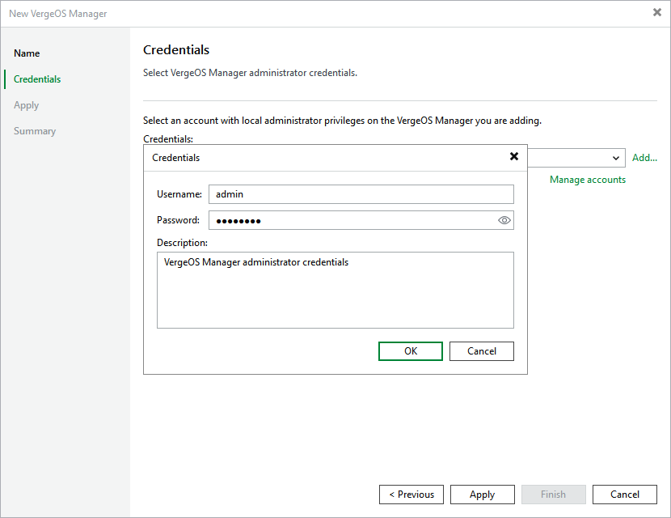

# Step 3. Enter Credentials

At the Credentials step of the wizard, specify credentials of an account that will be used to access the Universal Hypervisor Manager.

For credentials to be displayed in the Credentials list, they must be added to the Credentials Manager as described in section [Standard Accounts](credentials_manager_windows.md). If you have not added the necessary credentials to the Credentials Manager beforehand, you can do this without closing the wizard.

After you click Next, the backup server will connect to the Universal Hypervisor Manager and check its TLS certificate. If the certificate is not trusted by the backup server, the Certificate Security Alert Window will display a warning notifying that secure communication cannot be guaranteed. To allow the backup server to connect to the Universal Hypervisor Manager using the certificate, click Continue.

Page updated 2026-07-23

