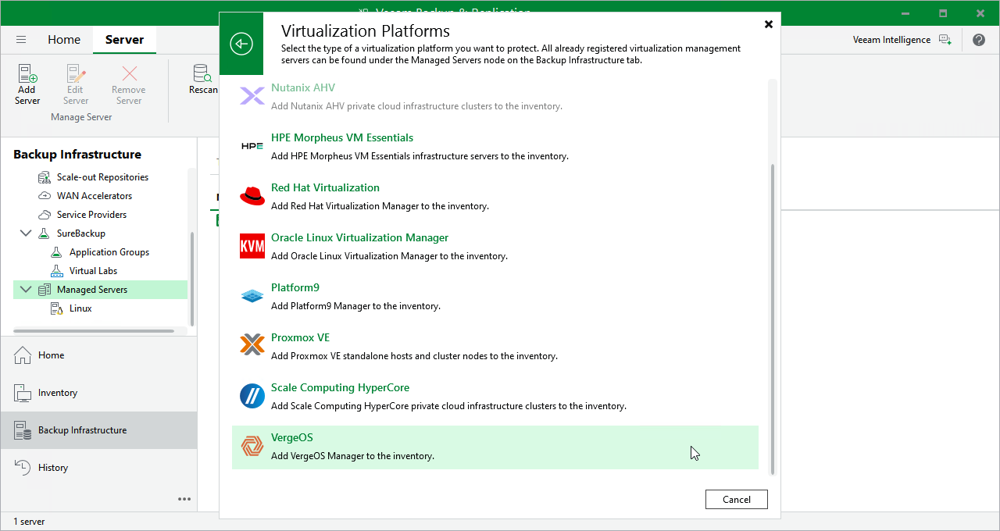

# Step 1. Launch New Manager Wizard

To launch the New Manager wizard, do the following:

1. In the Veeam Backup & Replication console, open the Backup Infrastructure view.
2. In the inventory pane, select Managed Servers.
3. On the ribbon, click Add Server.
4. In the Add Server window, select Virtualization Platforms.

1. In the Virtualization Platforms window, select the necessary hypervisor to launch the New Manager wizard.

|  |
| --- |
| Note |
| Currently, Veeam Plug-in for Universal Hypervisor API supports the VergeOS and Platform9 universal hypervisors. |

Page updated 2026-07-10

