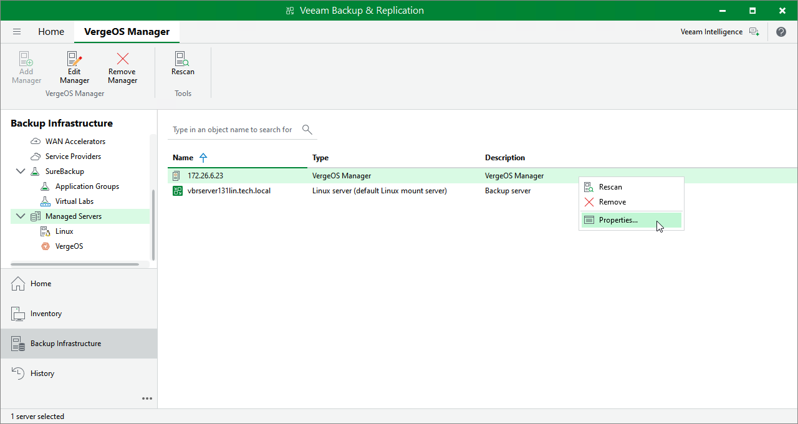

# Editing Universal Hypervisor Manager Properties

To edit properties of the Universal Hypervisor Manager added to the backup infrastructure, do the following:

1. Open the Backup Infrastructure view.
2. In the inventory pane, select Managed Servers > universal hypervisor.
3. In the working area, select the Universal Hypervisor Manager and click Edit Server on the ribbon, or right-click the Universal Hypervisor Manager and select Properties.
4. Complete the Edit Manager wizard as described in section [Adding Universal Hypervisor Manager to Backup Infrastructure](uh_server_add.md).

Page updated 2026-07-24

