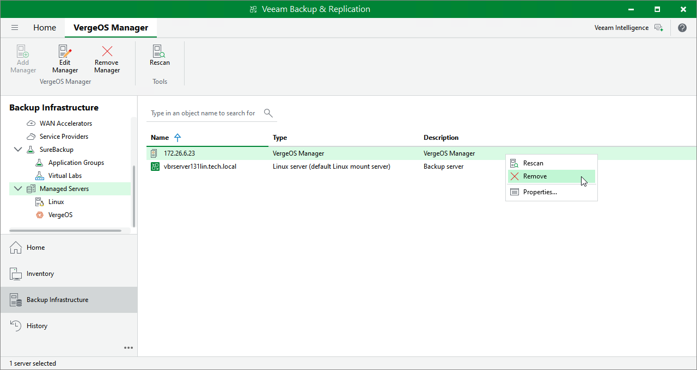

# Removing Universal Hypervisor Manager

If you do not want to protect resources managed by the connected Universal Hypervisor Manager anymore, you can remove it from the backup infrastructure.

|  |
| --- |
| Note |
| If you remove the Universal Hypervisor Manager from the backup infrastructure, Veeam Backup & Replication will also remove workers and worker VM images from the universal hypervisor clusters. |

To remove the Universal Hypervisor Manager from the backup infrastructure:

1. Open the Backup Infrastructure view.
2. In the inventory pane, select Managed Servers > universal hypervisor > universal hypervisor Servers.
3. In the working area, select the Universal Hypervisor Manager and click Remove Server on the ribbon, or right-click the Universal Hypervisor Manager and select Remove.

Page updated 2026-07-10

